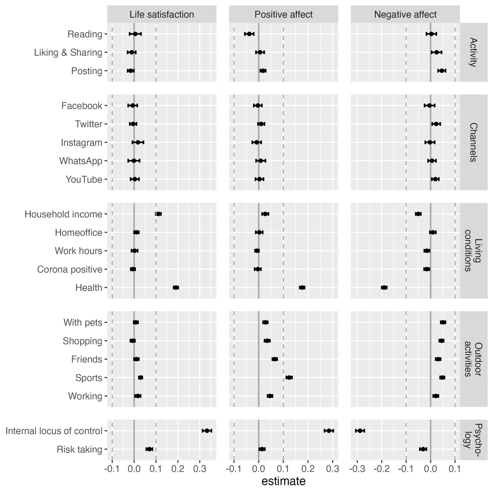

```{r set-up, include=F, cache=F}
set.seed(170819) # Seed for random number generation

knitr::opts_chunk$set(
  cache.extra = knitr::rand_seed,
  cache = T, 
  echo = F, 
  error = F,
  cache.lazy = FALSE
  )

# install necessary packages
# devtools::install_github("https://github.com/tdienlin/td@v.0.0.2.5")
# devtools::install_github("https://github.com/crsh/papaja@devel")

# load packages
library(devtools)
library(english)
library(GGally)
library(ggplot2)
library(gridExtra)
library(kableExtra)
library(lavaan)
library(lme4)
library(lmerTest)
library(magrittr)
library(papaja)
library(tidyverse)
library(td)
```

```{r load-data, include=F, cache=T}
# load workspace created from analyses.rmd to use results
load("data/workspace_3.RData")
```

During the COVID-19 pandemic it was critical to stay informed regarding the latest developments.
How dangerous is the virus? 
In what region is it spreading? 
How is it transmitted? What are the current safety regulations?
To obtain relevant information, many people heavily relied on social media, with use being at an all time high [@statistaAverageDailyTime2021].
Some actually could not stop using social media to learn about COVID-19 related news.
A new phenomenon termed "doomscrolling" emerged [@sharmaDarkEndTunnel2022].
Many users were glued to their screens and found it hard to pursue other relevant activities such as working, taking a break, or even looking after their children [@kleinDarklySoothingCompulsion2021].
In the media it was hence increasingly asked whether using social media for COVID-19 related reasons would, next to all other stressors, create an additional burden on mental health [@sandstromDoomscrollingCOVIDNews2021].
Although research has begun addressing this question
[e.g., @bendauAssociationsCOVID19Related2021; @edenMediaCopingCOVID192020; @sewallObjectivelyMeasuredDigital2021],
<!-- [@bendauAssociationsCOVID19Related2021; @bradleyStressMoodSmartphone2021; @choiMediatedCommunicationMatters2021; @dornemannHowGoodBad2021; @edenMediaCopingCOVID192020; @guazziniSecondWaveAnalysis2022; @latikkaLonelinessPsychologicalDistress2022; @liuRelationOfficialWhatsAppdistributed2020; @riehmAssociationsMediaExposure2020; @sewallObjectivelyMeasuredDigital2021; @stainbackCOVID1924News2020; @yuePassiveSocialMedia2022] -->
it still largely unknown if COVID-19 related social media use during the pandemic has had a meaningful impact on well-being.
This study hence aims to 1) reveal the effect of the different types and channels of social media use on individual well-being, 2) provide generalizable and robust results by analyzing a large-scale longitudinal data-set with 34 waves, and 3) determine the within-person causal effects by analyzing how changes in social media use lead to changes in well-being.

## Understanding Well-being and Media Use

<!-- Two underlying theories guided the selection of variables for this study, namely the two-continua model of mental health [@greenspoonIntegrationSubjectiveWellbeing2001] and the hierarchical taxonomy of computer-mediated communication [@meierComputermediatedCommunicationSocial2020a]. -->
<!-- According to the two-continua model, mental health consists of (a) psychopathology and (b) well-being. -->
<!-- <!-- Because the aim of this study is better to understand typical users and everyday contexts, my focus will be on well-being. -->
<!-- Well-being can be differentiated into subjective and psychological well-being [@dienerAdvancesOpenQuestions2018]. -->
<!-- Whereas subjective well-being emphasizes hedonic aspects such as happiness and joy, psychological well-being addresses eudaimonic aspects such as fulfillment and meaning. -->
<!-- Subjective well-being is primarily about achieving positive and avoiding negative affect. -->
<!-- One of the most prominent indicators of well-being is life satisfaction. -->
<!-- In my view, because it represents a general appraisal of one's life, life satisfaction is best thought of as a meta concept combining psychological and subjective well-being. -->
<!-- Notably, life satisfaction is stable and fluctuates only little, whereas it's the exact opposite for affect [@dienlinImpactDigitalTechnology2020]. -->
<!-- <!-- Everyone can feel bad on any given day, but whether or not one feels generally comfortable in one's life rather changes across years. -->
<!-- To capture well-being in this study I thus build on life satisfaction, positive affect, and negative affect. -->
<!-- Together, this should provide an encompassing perspective on potential media effects. -->

<!-- The hierarchical taxonomy of computer-mediated communication differentiates six levels of how people engage with digital technology. -->
<!-- First, the device (e.g., smartphone); second, the type of application (e.g., social networking site); third, the branded application (e.g., Twitter); fourth, the feature (e.g., status post); fifth, the interaction (e.g., one-to-many); and sixth, the message (e.g., content) [@meierComputermediatedCommunicationSocial2020a]. -->
<!-- Whereas the first four levels focus on the communication _channel_, the last two address the communication _type_. -->
<!-- Distinguishing different communication channels and communication types is important, because the effects on well-being likely differ across communication channels and communication types. -->
<!-- Whereas active social media use such as chatting is routinely linked to improved well-being, passive use such as reading is often considered more negative [@dienlinImpactDigitalTechnology2020]. -->
<!-- Similarly, branded apps are separate communication entities with potentially divergent effects and affordances. -->
<!-- For example, @waterlooNormsOnlineExpressions2018 found that it's more adequate to express negative emotions on WhatsApp than on Twitter or on Instagram. -->
<!-- Especially during a pandemic, it makes sense to analyze if users engage with COVID-19 related content on Instagram, where communication is more positive, or on Facebook, where communication is more critical. -->
<!-- First studies suggest that during the pandemic Instagram use was indeed more beneficial for well-being than Facebook use [@masciantonioDonPutAll2021]. -->
<!-- In this study, to measure the effects of social media use focused on COVID-19 related news and topics, I adopt both the channel and the type of communication perspective. -->
<!-- Together, this should offer a nuanced and comprehensive understanding of communication. -->

This study investigates how different _facets_ of well-being are affected by different _types_ and different _channels_ of communication [@meierComputermediatedCommunicationSocial2020a].
<!-- , namely active and passive use [@ellisonWhyWeDon2020; @meierComputermediatedCommunicationSocial2020a]. -->
<!-- Defining what constitutes active and what passive use is not always clear, and different understandings are currently discussed [@ellisonWhyWeDon2020; @meierComputermediatedCommunicationSocial2020a]. -->
<!-- Reading is generally considered as passive and writing as active use, while there are also specific behaviors falling somewhere in-between such as liking or sharing content [@meierDoesPassiveSocial2022]. -->
<!-- In this study,  -->
Building on the typology of subjective well-being [@dienerAdvancesOpenQuestions2018], three different well-being facets are analyzed: life satisfaction, positive affect, and negative affect.
Because effects of social media depend on how they are used [@verduynPassiveFacebookUsage2015], I further distinguish three types of use and five popular channels. 
The types of use include reading, liking and sharing, and posting COVID-19 related content.
In doing so, this study analyzes social media use focused on COVID-19 related content, which includes posting thoughts about the pandemic, reading posts and comments, or retweeting and liking COVID-19 related news.
Liking and sharing are combined as they both represent low-threshold, platform-ingrained, easily quantifiable interactions.
The five channels to be investigated are Facebook, Twitter, Instagram, WhatsApp, and YouTube, which at the time ranked among the most popular social media services in Austria.

## Social Media Effects on Well-Being

<!-- <!-- In conclusion, most effects are likely somewhere between trivial and small. -->
<!-- <!-- I therefore expect that also in the case of COVID-19 related social media use effects will be trivial to small. -->

<!-- In what follows, I outline potential arguments as to why the effect might be positive or negative, direct or indirect, or nonexistent. -->
How easily can well-being be affected by external influences?
In general, according to the set-point theory, well-being is surprisingly stable [@lykkenHappinessWhatStudies1999].
Although specific events such as marriage or salary increase can have significant impacts on well-being, in most cases effects are only short-term, with well-being after some time returning to prior levels [@sheldonStabilityHappinessTheories2014].
Only very specific factors such as unemployment, disability, or death can cause long-term changes in well-being [@lucasAdaptationSetpointModel2007].
So although well-being can be affected by external events and factors, this does not happen easily.
<!-- Although the set-point theory has been criticized lately because events such as marriage, unemployment, or death can indeed lead to long-term changes, it is still widely maintained that well-being is very stable and hence hard to be influenced  -->

Can social media use be such a factor?
Current literature overviews suggest that social media use on average does seem to decrease well-being [@meierComputermediatedCommunicationSocial2020a].
However, for most well-being outcomes, such as life satisfaction, general well-being, or loneliness, the effects are small [@meierComputermediatedCommunicationSocial2020a].
These small findings can be explained with the differential susceptibility of media effects model [@valkenburgDifferentialSusceptibilityMedia2013], which states that there is substantial _variation_ of media effects for individual users.
Whereas for some users social media are more beneficial, for others they are more harmful.
On average, however, and this is central for this study here, effects tend to be small [@valkenburgDifferentialSusceptibilityMedia2013].
For example, in one study it was estimated that roughly one quarter of all users experienced negative effects, another quarter positive effects, while for the rest the effects were neutral [@beyensSocialMediaUse2021].
Whether or not effects are positive or negative depend on (a) dispositional factors (e.g., personality, temperament, gender), (b) developmental factors (e.g., age, developmental tasks), (c) and social factors (e.g., environment, norms, upbringing).
Finally, effects depend also on the content that is consumed.
If the content is aligned with dispositions, developmental capacities, and converging contexts, effects tend to be stronger [@valkenburgDifferentialSusceptibilityMedia2013].

Why are the effects of social media use on well-being small on average?
Two prominent media effect theories argue implicitly against strong average negative effects.
First, according to mood management theory [@zillmannMoodManagementCommunication1988], using media can affect people's moods.
Use can be stimulating or overwhelming, relaxing or boring.
After some time, users implicitly learn which media help them balance their mood and affect according to their own situational needs [@zillmannMoodManagementCommunication1988].
Those media that eventually become part of one's media repertoire hence, on average, tend to be beneficial for users to regulate their mood [@marcianoDynamicsAdolescentsSmartphone2022]. 
In conclusion, if a certain medium is used frequently, mood-management theory argues that it is likely not detrimental for well-being.
<!-- For example, using experience sampling of well-being and logs of social media use, a study with 82 participants from Italy found that after episodes of social media use, levels of positive affect increased significantly [@marcianoDynamicsAdolescentsSmartphone2022]. -->
On the other hand, although mood management theory suggests that effects should not be overly negative, it could be that although short-term effects are positive, long-term effects are negative. 
<!-- it is still possible that people misjudge media effects. -->
<!-- Users are often overly optimistic [@metzgerComparativeOptimismPrivacy2017], focusing on short term benefits while ignoring long-term costs.  -->
Precisely because social media have so many positive consequences in the short run, this might cause problem in the long run---for example, because social media use displaces other potentially more meaningful and/or relaxing activities [@hallSocialMediaUse2022].
<!-- In other words, social media might not problematic because they are inherently bad, but rather because they are too good. -->
As with many other things, there can be too much of a good thing.
It is therefore often asked whether social media can become addictive, and users sometimes express this fear themselves [@yangCanWatchingOnline2021].
However, a recently published meta-analysis found that the two most prominent measures of addiction, the Bergen Facebook Addiction Scale and the Bergen Social Media Addiction Scale, have only small relations to well-being [@duradoniWellbeingSocialMedia2020].
In addition, the general idea of labeling excessive social and new media use as addiction was criticized, arguing that social media use represent a new regular behavior that should not be pathologized [@galerHowMuchToo2018; @vanrooijWeakScientificBasis2018].
<!-- In conclusion, there are several plausible theoretical mechanisms as to why effects might be negative or positive, explaining why on average effects might not be particularly negative or positive. -->

Second, while mood management theory considers media use mainly driven by implicit learning experiences, uses and gratifications theory upholds that the process is more explicit and rational [@katzUsesGratificationsResearch1973].
Users select those media that they expect to have a desired effect, for example on mood, knowledge, or entertainment.
If those beneficial media effects are missing, people will spend their time elsewhere.
And social media, in general, offer several beneficial effects, explaining why they are used that much.
They help find relevant information, maintain and foster relationships, express one's personality, and entertain oneself [@pelletierOneSizeDoesn2020].
In conclusion, because people spend so much time on social media consuming COVID-19 related content, according to both mood management theory and uses and gratifications theory this indirectly suggest that average effects on well-being are likely not particularly negative.

## Social Media During COVID-19

If we look at COVID-19 related use more specifically, how could the various types and channels of COVID-19 related social media use affect well-being?
Several uses and gratifications exist, which help explain why people used social media frequently during the pandemic.
<!-- , outlining mechanisms of potential positive effects.  -->
<!-- At the same time, there are also several plausible reasons as to why COVID-19 related social media use is beneficial for well-being. -->
Access to information and resources: 
Despite incorrect information, social media provide a vast platform for disseminating accurate and timely information about COVID-19 [@johnhopkinsuniversityCOVID19Map2023]. 
It allows individuals to stay informed about the latest updates, guidelines, and recommendations from reputable health organizations and experts. 
Access to reliable information can help people make informed decisions, alleviate uncertainties, and feel empowered during the pandemic.
Educational opportunities: 
Social media can be a valuable educational tool, with various organizations and experts sharing informative content about COVID-19 [@worldhealthorganizationCoronavirusDiseaseCOVID192023]. 
This can include explanatory videos, infographics, and articles that help individuals understand the virus, its transmission, prevention strategies, and vaccination information. 
Access to educational resources on social media can empower individuals to make informed decisions regarding their health.
Community support and solidarity: 
Social media platforms enable individuals to connect with others who are experiencing similar challenges during the pandemic [@guazziniSecondWaveAnalysis2022]. 
Sharing experiences, offering support, and expressing solidarity can foster a sense of community and reduce feelings of isolation. 
Engaging in online communities and support groups can provide emotional support and create a network of like-minded individuals.
Promoting mental health and well-being: 
Many mental health organizations and professionals utilize social media to share tips, strategies, and resources for maintaining mental well-being during the pandemic [@twitterTalkingMentalHealthAwarenessTwitter2020]. 
They provide guidance on coping mechanisms, stress reduction techniques, and self-care practices. 
Engaging with such content might help individuals prioritize their mental health and develop resilience during challenging times.
Encouraging positive behaviors: 
Social media campaigns and initiatives can promote positive behaviors related to COVID-19, such as mask-wearing, physical distancing, hand hygiene, and vaccination [@atheyDigitalPublicHealth2023; @huntSocialMediaBased2022]. 
Public health organizations and influencers leverage the power of social media to spread awareness and encourage responsible actions, contributing to public health efforts and fostering a sense of collective responsibility.
<!-- Amplifying diverse voices and perspectives:  -->
<!-- Social media platforms provide a space for diverse voices and perspectives to be heard [@brunsAreFilterBubbles2019].  -->
<!-- This allows individuals to access a range of viewpoints, experiences, and cultural practices related to COVID-19.  -->
<!-- Exposure to diverse perspectives might promote empathy, understanding, and a more comprehensive understanding of the pandemic's impact on different communities. -->

On the other hand, the effects might be negative, perhaps best explained by the following five mechanisms.
Misinformation and rumors: 
Social media platforms can easily spread false or misleading information about COVID-19 [@liYouTubeSourceInformation2020]. 
Due to the ease of sharing and the lack of fact-checking, inaccurate information can go viral and might cause confusion, anxiety, and panic among users.
Overwhelm and anxiety: 
Constant exposure to COVID-19-related content on social media can lead to information overload and contribute to heightened anxiety levels [@fanInformationOverloadWellbeing2021]. 
The rapid spread of news, updates, and opinions can be overwhelming and might exacerbate existing stress or fears about the pandemic [@sharmaDarkEndTunnel2022].
Confirmation bias and echo chambers: 
Social media algorithms are designed to show users content that aligns with their interests and beliefs, potentially contributing to echo chambers [@cinelliEchoChamberEffect2021]. 
This might lead to confirmation bias, where individuals are more likely to be exposed to information that confirms their preexisting beliefs. 
In the context of COVID-19, this might reinforce false or misleading information and prevent individuals from considering alternative perspectives.
Cyberbullying and harassment: 
Social media platforms are known for fostering negativity, with users sometimes engaging in cyberbullying and harassment [@giumettiCyberbullyingSocialMedia2022]. 
Discussions around COVID-19 can become heated and polarized, leading to personal attacks and online conflicts. 
Such experiences threaten mental well-being and might contribute to feelings of distress and isolation.
Social comparison and fear of missing out (FOMO): 
Social media often showcase the highlights and accomplishments of others, encouraging social comparison [@przybylskiMotivationalEmotionalBehavioral2013]. 
During a pandemic, seeing posts about others' successes or seemingly perfect lives might intensify feelings of inadequacy or FOMO, especially when individuals are unable to participate in similar activities due to restrictions or personal circumstances [@sharmaDarkEndTunnel2022].
<!-- Reduced face-to-face interaction:  -->
<!-- Spending excessive time on social media to learn about COVID-19 can lead to a decrease in face-to-face interactions and real-life connections [but see @hallSocialMediaUse2022].  -->
This might impact mental health, as most humans have an innate need for social support and physical presence, which online interactions might not fully replicate.

<!-- Using Social media is ambivalent. -->
<!-- It can impair well-being when causing embarrassment, stress, or disinformation, and it can improve well-being when providing connectedness, information, or entertainment [@buchiDigitalWellbeingTheory2021]. -->
<!-- Although social media are often associated with negative outcomes, there are a large number of positive effects, which either offset or at least significantly reduce negative outcomes. -->
<!-- Positive outcomes encompass finding relevant information; maintaining and fostering relationships; expressing one's personality; or entertaining oneself [e.g., @pelletierOneSizeDoesn2020]. -->
<!-- Negative effects include distraction; displacement of other meaningful activities; consumption of shallow, misleading or challenging content; or negative social comparisons [e.g., @meierDoesPassiveSocial2022]. -->
<!-- People are much more likely to use media that offer plentiful benefits [@katzUsesGratificationsResearch1973]. -->
<!-- Users implicitly learn what media help them regulate their mood and thereby well-being [@zillmannMoodManagementCommunication1988]. -->
<!-- Given the ubiquitous use of social media, the many benefits they offer, plus the general and implicit competence to use media that foster mood management, it is hence unlikely that the effects of social media use on well-being are profusely negative. -->

<!-- As outline above,   -->
There is still little empirical research on how well-being is affected by social media use that is focused on COVID-19 specifically.
Echoing the theoretical rationales outlines above, studies have yielded mixed results.
Some studies found negative effects, indicating that excessive social media use for COVID-19 news led to compulsive behavior and increased stress levels, particularly due to upward social comparison [@kleinDarklySoothingCompulsion2021; @stainbackCOVID1924News2020; @yuePassiveSocialMedia2022]. 
Individuals who relied on social media as their primary information source reported higher levels of anxiety and depression symptoms [@bendauAssociationsCOVID19Related2021]. 
Similarly, increased COVID-19-related media consumption was associated with higher psychological distress.
On the other hand, some studies reported positive outcomes. 
Certain individuals experienced increased virtual community and social connectedness during the pandemic through social media, which contributed to their well-being [@guazziniSecondWaveAnalysis2022]. 
Additionally, engaging more on social media was associated with reduced feelings of loneliness [@latikkaLonelinessPsychologicalDistress2022].
A couple of studies reported mostly neutral effects of social media use on well-being indicators [@bradleyStressMoodSmartphone2021; @edenMediaCopingCOVID192020; @sewallObjectivelyMeasuredDigital2021].
Overall, the literature demonstrates a mixed picture, highlighting both positive and negative effects of social media use focused on or during COVID-19 on well-being [see also @bradleyStressMoodSmartphone2021; @dornemannHowGoodBad2021; @liuRelationOfficialWhatsAppdistributed2020; @riehmAssociationsMediaExposure2020; @sewallObjectivelyMeasuredDigital2021].

<!-- It is important to consider individual differences, usage patterns, and other factors that may influence the impact of social media on well-being during this challenging period. -->

<!-- ## Empirical Studies on Social Media Effects -->

<!-- There is still little empirical research on how well-being is affected by social media use that is focused on COVID-19 specifically. -->
<!-- Results are mixed. -->
<!-- When browsing social media for COVID-19 related news, many users reported being captivated to such an extent they could not stop using social media [@kleinDarklySoothingCompulsion2021]. -->
<!-- During the pandemic social media use was at an all-time high in the US [@statistaAverageDailyTime2021], for example to cope with the required physical distancing measures. -->
<!-- In a study with 1,131 residents from Wuhan in China, people who spent more time in quarantine also spent more time on social media [@yuePassiveSocialMedia2022].  -->
<!-- Those who spent more time on social media also engaged in more upward social comparison, which was related to increased levels of stress. -->
<!-- People who used social media as a primary source of information reported on average "significantly more unspecific anxiety and depression [...] and significantly more specific COVID-19 related anxiety symptoms" [@bendauAssociationsCOVID19Related2021, p. 288]. -->
<!-- @edenMediaCopingCOVID192020 analyzed how 425 US college students used media during the first wave of the pandemic, finding both positive and negative relations with well-being. -->
<!-- In a sample of 312 respondents collected via Amazon Mechanical Turk, people who used media to attain information were more lonely and less satisfied with their lives [@choiMediatedCommunicationMatters2021]. -->
<!-- In a large-scale study with 11,537 respondents from the US, increased COVID-19-related media consumption was related to more psychological distress [@stainbackCOVID1924News2020]. -->
<!-- A four-wave panel study with 384 young adults from the U.S. analyzed the effects of general digital technology use during the pandemic on mental health, finding that digital technology did not have significant effects on mental health [@sewallObjectivelyMeasuredDigital2021; for a similar study with comparable results, see @bradleyStressMoodSmartphone2021]. -->
<!-- A study with 2.057 respondents from Italy reported that during the pandemic virtual community and social connectedness increased [@guazziniSecondWaveAnalysis2022]. -->
<!-- In a study with 735 participants from Finland, levels of loneliness were stable during the pandemic, and people who engaged more on social media experienced less loneliness [@latikkaLonelinessPsychologicalDistress2022]. -->
<!-- Together, the literature is mixed, showing both positive and negative affects of social media use focused on or during COVID-19 on well-being [see also @dornemannHowGoodBad2021; @liuRelationOfficialWhatsAppdistributed2020; @riehmAssociationsMediaExposure2020]. -->

In conclusion, given these mixed empirical results, together with the observation that social media effects on well-being are very small in general, and that several plausible theoretical mechanisms exist for both positive and negative effects, I expect that COVID-19 related communication on social media should not be decidedly positive or negative.
It seems most likely that both positive and negative coexist, but that on average using social media for COVID-19 related reasons should not have substantial effects on well-being.

> Hypothesis: The within-person effects of all measures of COVID-19 related social media use (types: reading, liking and sharing, posting; channels: Twitter, Instagram, Facebook, YouTube, WhatsApp) on all measures of well-being indicators (positive affect, negative affect, life satisfaction)---while controlling for several stable and varying covariates such as sociodemographic variables and psychological dispositions (see below)---will be trivial.

<!-- Although the average effect of use on well-being is likely very small, it might be that specific subgroups exhibit larger effects. -->

<!-- > Research question: How do the effects of COVID-19 related social media use on well-being depend on gender, age, immigration background, education, and urban living context? -->

<!-- Because media effects can differ across users, situations, and content [@livingstoneEuropeanResearchChildren2018; @valkenburgDifferentialSusceptibilityMedia2013], I now briefly focus on the effects of COVID-19 related social media use specifically. -->
<!-- First, one could assume a _direct_ negative effect on well-being, and especially on positive or negative affect, which are more volatile and fluctuating. -->
<!-- Dangers, inequalities, corruption---these were the headlines during the pandemic across many countries worldwide. -->
<!-- If one learns about such events, the initial reaction might be shock, fear, or dismay. -->
<!-- Consuming such news can be depressing [@dornemannHowGoodBad2021], perhaps even changing some general perspectives on life. -->
<!-- <!-- So, just like being hit by a hammer hurts and we don't need any "mediating mechanism", this could be the case here as well. -->
<!-- That said, because not all news was negative, and because many people showed solidarity and compassion, there was also positive and uplifting content, potentially compensating for the negative effects [@dornemannHowGoodBad2021]. -->
<!-- A study with 2.057 respondents from Italy reported that during the pandemic virtual community and social connectedness even increased [@guazziniSecondWaveAnalysis2022]. -->

<!-- In a study with 735 participants from Finland, levels of loneliness did not decrease during the pandemic, and people who engaged more on social media experienced less loneliness [@latikkaLonelinessPsychologicalDistress2022]. -->
<!-- However, in light of a worldwide pandemic with millions of deaths, the negative direct effect seems more plausible. -->

<!-- Second, there could also be _indirect_ effects. -->
<!-- Although it is most likely that moderate social media use is not detrimental [@orbenTeenagersScreensSocial2020], overuse, however, might be more critical, and several studies have shown more pronounced negative effects for extreme users [@przybylskiLargescaleTestGoldilocks2017]. -->
<!-- To explain, overuse could impair well-being if it replaces meaningful or functional activities such as meeting others, working, actively relaxing, or exercising. -->
<!-- Another potentially negative mechanism at play are problematic social comparison processes.  -->
<!-- Therefore, if a society collectively overuses social media during a pandemic, there is potential for negative effects. -->
<!-- If overuse replaces such activities it's reasonable to assume that it's also detrimental. -->

<!-- On the other hand, one can make the case that using social media for COVID-19 related reasons might even be beneficial, especially in times of a pandemic. -->
<!-- Exchanging COVID-19 related messages with friends via WhatsApp might replace the in-person contact one would have otherwise, but which is literally impossible at the time. -->
<!-- In situations where meaningful and functional activities are prohibited, using social media to exchange about COVID-19 related topics might not be the worst idea. -->
<!-- Besides, given that nowadays a large number of experts, scientists, and politicians converse directly on social media, one can get first-hand high quality information on current developments. -->
<!-- <!-- On the other hand, there is of course also much disinformation, and "bingeing" on COVID-19 fake news might also pose risks for impaired well-being. -->

<!-- To summarize, it seems that from a theoretical perspective it is most likely that the average effects of social media use on well-being are negligible.  -->
<!-- Building on established theories from Communication and current empirical findings, we would not assume that effects are either profoundly negative or strongly positive. -->

<!-- However, note that all of these findings represent between-person relations stemming from cross-sectional data (see below). -->
<!-- We therefore don't know whether the differences in mental health and well-being are due to social media use or due to other third variables, such as age, health, employment, or education. -->

<!-- The question of whether and how social media use affects well-being _in general_, on the other hand, is well-researched. -->
<!-- This also holds true for the different types of communication such as active or passive use. -->
<!-- What determines whether or not an effect should be considered small or trivial? -->
<!-- As a starting point, we could refer to standardized effect sizes. -->
<!-- According to @cohenPowerPrimer1992, small effect sizes start at _r_ = .10. -->
<!-- Finally, several individual studies employing advanced methods found smalls relations between social media use and well-being [@orbenSocialMediaEnduring2019; @przybylskiDoesTakingShort2021a; @schemerImpactInternetSocial2021; @kerestesAdolescentsOnlineSocial2020]. -->
<!-- Although for roughly one quarter of all users the effects of social media use on well-being were negative, for almost the same number of users they were positive, while for the rest the effects were neutral [@beyensSocialMediaUse2021]. -->
<!-- This finding is aligned with the Differential Susceptibility to Media Effects Model:  -->
<!-- Although there is substantial _variation_ of media effects for individual users, the _average_ effects reported in the literature are often small [@valkenburgDifferentialSusceptibilityMedia2013].  -->

<!-- Together, the strongest argument to me is that _in general_ the effects of social media on well-being are, on average, small at best.  -->
<!-- Because this study only looks at _one part_ of social media use---namely, COVID-19 related interactions---it is very focused, diminishing the overall potential of the effects even further. -->
<!-- Whether or not using social media for COVID-19 related aspects is detrimental during a pandemic is also not entirely clear. -->
<!-- At least, there does not seem to be a case where we should expect a clear deviation to the negative, despite anecdotes of doomscrolling. -->

<!-- A meta review (i.e., an analysis of meta-analyses) found that the relation between social media use and well-being is likely in the negative spectrum but very small, potentially too small to matter [@meierComputermediatedCommunicationSocial2020a]. -->
<!-- And indeed, several if not most of the current meta-analyses find small to trivial effects [@huangTimeSpentSocial2017; @meierComputermediatedCommunicationSocial2020a; @fergusonThisMetaanalysisScreen2021]. -->

<!-- In this study, this general hypothesis will be analyzed specifically for the three communication types of (a) time spent reading, (b) liking and sharing, and (c) actively posting COVID-19 related content. -->
<!-- In addition, I will analyze how well-being is influenced by spending time on five prominent social media apps, including (a) Facebook, (b) Instagram, (c) Twitter, (d) WhatsApp, and (e) YouTube.  -->

# Method
## Preregistration

The hypotheses, the sample, the measures, the analyses, and the inference criteria (SESOI, _p_-value) were preregistered on the Open Science Framework, accessible here: https://osf.io/87b24/?view_only=b2289b6fec214fa88ee75a18d45c18f3.
Because in this study I analyze data from an already existing large-scale data set, the preregistration was done prior to accessing the data.
The preregistration was designed on the basis of the panel documentation online [@kittelAustrianCoronaPanel2020].
In some cases, it was impossible to execute the analyses as I had originally planned, for example because some properties of the variables only became apparent when seeing the actual data.
The most relevant deviations are reported below, and a complete list of all changes can be found in the online [companion website](https://XMtRA.github.io/Austrian_Corona_Panel_Project) (https://XMtRA.github.io/Austrian_Corona_Panel_Project).

## Sample

The data come from the Austrian Corona Panel Project [@kittelAustrianCoronaPanel2021], which is a large-scale standalone panel study. 
The data are hosted on AUSSDA, are publicly available here (https://doi.org/10.11587/28KQNS), and consist of 34 waves.
Participants were sampled from a pre-existing online access panel provided by the company Marketagent, Austria.
Panel members were incentivized with 180 credit points for each wave of the study.
The study was conducted between March 2020 and February 2023.
Between March 2020 and July 2020, the intervals between waves were weekly, until May 2022 (wave 32) monthly, and afterward after 5 months.
Each wave consists of at least 1,500 respondents.
Panel mortality was compensated through a continuous re-acquisition of new participants. 
The sample size was _N_ = `r d_raw %>% nrow() %>% prettyNum(big.mark = ",")`, with overall `r d_long %>% nrow() %>% prettyNum(big.mark = ",")` observations.
For an overview of the study set-up, see Figure \@ref(fig:study-desc).

```{r study-desc, warning=F, message=F, fig.cap="Overview of study set-up", out.width = "1\\textwidth", warning=F, message=F, prompt=F}
knitr::include_graphics("figures/fig_study_description.png")
```

Achieved via quota sampling, the sample matched the Austrian population in terms of age, gender, region/state, municipality size, and educational level.
In order to participate in the study, the respondents needed to be Austrian residents and had to be at least 14 years of age. 
All respondents needed to have access to the internet (via computer or mobile devices such as smartphones or tablets). 
Ethical review and approval was not required for the study in accordance with the local legislation and institutional requirements. 
The participants provided their written informed consent to participate in this study.
The average age was `r mean(2021 - d_wide$year_birth, na.rm = T) %>% round(0)` years, `r mean(d_wide$male, na.rm = T) %>% round(., 2) * 100` percent were male, `r (d_wide %>% filter(.$edu_fac %in% c("State college", "Bachelor", "Master", "PhD"))) %>% nrow() %>% divide_by(sum(table(d_wide$edu_fac))) %>% multiply_by(100) %>% round(0)` percent had a University degree, and `r (table(d_wide$employment_fac)["Unemployed"] / sum(table(d_wide$employment_fac))) %>% unname() %>% multiply_by(100) %>% round(., digits = 0)` percent were currently unemployed.

<!-- # Current Study -->
## Smallest Effect Size of Interest
<!-- ## Inference Criteria -->

Testing the hypothesis necessitates defining what is considered a "trivial effect size". 
<!-- Effectively testing this hypothesis  -->
<!-- Above I already referred to standardized effect sizes. -->
<!-- However, standardized effect sizes should only be a first step toward evaluating an effect's relevance [@baguleyStandardizedSimpleEffect2009]. -->
<!-- Standardized effect sizes are determined by a sample's variance,[^cohensd] which is problematic:  -->
<!-- The question of whether or not social media use affects a particular person in a relevant way should not depend on the variance in the sample in which that person's data were collected. -->
<!-- Instead, it should depend on absolute criteria. -->
To this end, we need to define a so-called smallest effect size of interest (SESOI) [@lakensEquivalenceTestingPsychological2018].
A trivial effect would then need to be smaller than the SESOI (see below).
What could be a minimally interesting, nontrivial effect?
Being a normative question, finding a clear, single, or unanimous answer is impossible.
<!-- In the end, it is a personal question. -->
However, it is still necessary and helpful to work toward a plausible benchmark. 
I suggest the following SESOI for this research question:

> SESOI: If a heavy user of COVID-19 related social media news suddenly _stops_ using social media altogether, this should have a _noticeable_ impact on their overall well-being.

What does this mean practically and how can it be operationalized?
In this study, COVID-19 related social media use was measured on a 5-point scale, ranging from 1 = _never_ to 5 = _several times a day_. Thus, a change of four units in social media use (e.g., a complete stop) should correspond to a noticeable change in well-being.
What is a noticeable change in well-being?
According to @normanInterpretationChangesHealthrelated2003, people can reliably distinguish seven levels of satisfaction with health.
So if satisfaction is measured on a 7-point scale, a four unit change in social media use should result in a one unit change in life satisfaction. 
<!-- Because the data were analyzed post-hoc, no a-priori sample size planning on the basis of power analyses was conducted. -->
<!-- The sample is large, and it is hence well-equipped to reliably detect small effects. -->
<!-- <!-- , which is why no exact post hoc power analysis were conducted. -->
<!-- In addition, because such large samples easily generate significant _p_-values even for very small effects, it helps that the hypotheses were tested with a smallest effect size of interest-approach. -->
<!-- To this end, I adopted the interval testing approach as proposed by @dienesUsingBayesGet2014. -->
<!-- On the basis of the SESOI, I defined a null region. -->
<!-- In what follows, I explain how I determined the SESOI and the null region. -->

In this study, life satisfaction was measured on an 11-point scale.
If people can reliably differentiate 7 levels, this corresponds to 11 / 7 = `r round(11/7, 2)` unit change on an 11-point scale.
Hence, a four-point change in media use (e.g., a complete stop) should result in a `r round(11/7, 2)`-point change in life satisfaction.
In a statistical regression analysis, _b_ estimates the change in the dependent variable if the independent variable increases by one point.
For life satisfaction, we would therefore define a SESOI of _b_ = `r round(11/7, 2)` / 4 = `r round(11/7*.25, 2)`.
For positive or negative affect, which was measured on a 5-point scale, our SESOI would be _b_ = `r round(5 / 7, 2)` / 4 = `r round(5 / 7 * .25, 2)`.
Because we are agnostic as to whether the effects are positive or negative, the null region includes both negative and positive effects.
Finally, in order not to exaggerate precision and to be less conservative, these numbers are reduced to nearby thresholds.[^rounding] 
Together, this leads to a null region ranging from _b_ = -.30 to _b_ = .30 for life satisfaction, and _b_ = -.15 to _b_ = .15 for positive and negative affect.

[^rounding]: Note that other researchers also decreased or recommended decreasing thresholds for effect sizes when analyzing within-person or cumulative effects [@beyensSocialMediaUse2021; @funderEvaluatingEffectSize2019].

<!-- As explained above, for well-being the null region was between _b_ = -.30 and _b_ = .30 (i.e., _b_ = |.30|). -->
The hypothesis is analyzed using the interval testing approach as proposed by @dienesUsingBayesGet2014.
To illustrate, let us consider the case of life satisfaction [SESOI: -.30 : +.30]. 
If the 95% confidence interval falls completely within the null-region (e.g., _b_ = -.05, [95% CI: -.15, .05]), the hypothesis that the effect is trivial is supported.
If the confidence interval falls completely outside of the null-region (e.g., _b_ = -.40, [95% CI: -.45, -.35]), the hypothesis is rejected and the existence of a meaningful negative effect is supported.
If the confidence interval and the null region overlap (e.g., _b_ = -.30, [95% CI: -.35, -.25]), the hypothesis is not supported and the results are considered inconclusive, while a meaningful positive effect is rejected.
If the confidence interval exceeds both sides of the null region (e.g., _b_ = -.025, [95% CI: -.40, .35]), the hypothesis is not supported and judgement is suspended.
For an illustration, see Figure \@ref(fig:sesoi).

```{r sesoi, warning=F, message=F, fig.cap="Using confidence intervals to test a null region. In this study, a trivial effect of social media use on life satisfaction is defined as ranging from b = -.30 to b = .30. Figure adapted from Dienes (2014).", fig.width=6, fig.height=2, warning=F, message=F, prompt=F}
# make table with data
d_plot <- tribble(
  ~name, ~type, ~Effect, ~ll, ~ul,
  "1. Accept trivial effect", "Decision Rule", -.02, -.12, .08, 
  "2. Reject trivial effect", "Decision Rule", -.40, -.45, -.35,
  "3. Reject positive effect", "Decision Rule", -.25, -.15, -.35,
  "4. Suspend judgement", "Decision Rule", -.025, -.40, .35,
) %>% 
  mutate(
    name = factor(name, levels = name),
    name = fct_rev(name)
         )

# design plot
plot <- ggplot(d_plot, aes(y = name, x = Effect)) +
  geom_vline(xintercept = 0, color = "darkgrey") + 
  geom_vline(xintercept = -.3, color = "darkgrey", linetype = "dashed") +
  geom_vline(xintercept = .3, color = "darkgrey", linetype = "dashed") +
  geom_point(aes(Effect)) +
  geom_errorbarh(aes(xmin = ll, xmax = ul), height = .5) +
  theme(axis.title.y = element_blank()) +
  labs(x = "Effect Size (b)",
       caption = "Smallest effect size of interest: b = |.30|
                  Null region: b = -.30, .30")

# ggsave("figures/figure_intervals.png", height = 3.5)
plot
```

<!-- Responses were individually checked for patterns such as straight-lining or missing of inverted items. -->
<!-- X clear cases were removed. -->

## Data Analysis
### Causality

<!-- The hypothesis explicitly states a causal effect. -->
<!-- In non-experimental studies, longitudinal designs can help investigate causality. -->
When using longitudinal designs to analyze causality, it is important to (a) focus on within-person effects [@hamakerWhyResearchersShould2014]; to (b) control for confounders [@rohrerTheseAreNot2021]; and to (c) test a plausible interval between measures [@dormannOptimalTimeLags2015].
<!-- To illustrate, consider the following example. -->
<!-- Imagine that a person suddenly starts using social media much more than usual, and then after some time  becomes less satisfied with their life. -->
<!-- Eventually, use and life satisfaction return to prior levels. -->
<!-- If this happens to several people at the same time, in a longitudinal study we could then observe a significant effect of social media use on life satisfaction. -->
<!-- However, it could also be the case that during the study there was a major exogenous event (say, a pandemic), which caused large parts of the working population to loose their jobs. -->
<!-- Hence, the causal effect reported above was confounded, because in reality it was the pandemic that caused both social media use to rise and life satisfaction to go down. -->
<!-- Thus, only when controlling for _all_ relevant confounders, can we correctly estimate causality without bias [@rohrerThinkingClearlyCorrelations2018]. -->
<!-- Obviously, we can never be entirely sure to have included all confounders, which makes absolute statements regarding causality virtually impossible. -->
First, in non-experimental designs it makes much sense to analyze causal effects from an internal, within-person perspective [@hamakerWhyResearchersShould2014].
If a specific person changes their media diet, we need to measure how this behavior affects their well-being.
Between-person comparisons from longitudinal data cannot provide such insights [@lucasWhyCrossLaggedPanel2022].
To test the hypothesis, I thus consider only the within-person effects.

Second, to identify confounders we should control for variables that affect both media use and well-being, which helps isolate the actual effect [@rohrerThinkingClearlyCorrelations2018].
Because we are adopting a within-person perspective, we need to implement _time-varying_ confounders [@rohrerTheseAreNot2021]. 
And because we are determining the _overall_ causal effect, we need to make sure _not_ to control for mediating variables [@rohrerThinkingClearlyCorrelations2018], for doing so would bias our assessment of the causal effect.
<!-- Complicating matters further, it is often unclear if a variable is a mediator or a confounder.[^collider] -->
<!-- However, despite all these caveats, when controlling for relevant variables (that aren't mediators), we can be much more certain that we measured causality correctly. -->
<!-- The aim should therefore be to collect as many varying and non-varying confounders as possible (which I believe is seldom done in our field), while knowing that absolute certainty regarding causality cannot be reached. -->
<!-- [^collider]: In addition, there also exist colliders, which I don't discuss here and which complicate the issue even further [@rohrerThinkingClearlyCorrelations2018]. -->
<!-- We can also control for variables that affect only social media use or well-being.  -->
<!-- However, in doing so not much is gained, because the effects of social media use would remain virtually the same [@klinePrinciplesPracticeStructural2016; but see @mcelreathYesterdayClass2021]. -->
In this study, I hence preregistered to control for the following variables, which either have already been shown or are likely to affect both social media use and well-being, and which also are not mediators:
<!-- (I'll additionally include variables that likely affect only well-being, also to obtain a comparison benchmark for social media effects): -->
gender, age, education, Austria country of birth, Austria country of birth of parents, residency Vienna, text-based news consumption, video-based news consumption, household size, health, living space, access to garden, access to balcony, employment, work hours per week, being in home-office, household income, outdoor activities, disposition to take risks, and locus of control [@egerStatisticalMetaanalysisWellbeing2015; @wardOriginsHappinessEvidence2016].
<!-- [^explore] -->
<!-- I will not control for variables such as trust in institutions or trust in media, because these variables might be influenced by social media use to a meaningful extent. -->

<!-- [^explore]: The data-set includes many other variables that one could also potentially control for, and I invite interested readers to download the and explore potential interesting relationships. -->

<!-- Next to including covariates, it is now increasingly understood that  -->
Finally, one precondition of causality is temporal order and finding a plausible interval [@dormannOptimalTimeLags2015].
<!-- The cause needs to precede the effect. -->
<!-- Finding the right interval between cause and effect is crucial. -->
<!-- For example, if we want to understand the effect of alcohol consumption on driving performance, it makes a big difference if driving performance is measured one minute, one hour, one day, or one week after consumption. -->
<!-- Finding the right interval is difficult. -->
If variables are stable, longer intervals are needed; if they fluctuate, shorter intervals.
In the case of well-being, we need shorter intervals for the more fluctuating positive and negative affect, and longer ones for the more stable life satisfaction [@dienlinImpactDigitalTechnology2020].
Whereas using social media can have instant effects on mood [@marcianoDynamicsAdolescentsSmartphone2022], effects on life satisfaction often take longer to manifest.
For example, because media use leads to actual changes in specific behaviors, which then in turn affect life satisfaction [@dienlinDisplacementReinforcementReciprocity2017].
<!-- Choosing the right interval is challenging, because especially short intervals are hard to implement in practice, often requiring advanced methods such as experience sampling (also known as in situ measurement or ambulant assessment) [@schnauber-stockmannMobileDevicesTools2020]. -->

In this study, I hence analyze how changes in using social media _during the last week_ affected changes in positive and negative affect _during the same week_.
In other words, if people during the last week engaged in more COVID-19 related social media use than usual, did they feel better or worse during that week than usual?
For life satisfaction, I implemented a longer interval.
If people _during the last week_ used COVID-19 related social media more than they usually do, were they _at the end of the week_ more or less satisfied with their lives than they usually are?
This way it is analyzed if when a person changes their social media diet, are there (a) _simultaneous_ changes in their affect and (b) _subsequent_ changes in their life satisfaction?
For the main analyses, the interval is implemented via the wording of the items (see below), not by using lagged measures coming from prior waves waves. 
In additional analyses, I also tested how media use affects well-being one month or four months later.
<!-- This significantly increases sample size, such that all respondents who answered the media measures at least two times can be implemented. -->
All analyses will be controlled for varying confounders (see below), which fosters a causal interpretation.
<!-- Similar approaches were implemented by other studies [@johannesNoEffectDifferent2022; @scharkowHowSocialNetwork2020], and they are considered a best practice approach toward analyzing causality [@bellFixedRandomEffects2019]. -->

### Statistical model

The hypothesis was analyzed using random effect within-between models [REWB, @bellFixedRandomEffects2019]. 
Altogether three models were run, one for each dependent variable.
The data were hierarchical, and responses were separately nested in participants and waves (i.e., participants and waves were implemented as random effects).
Nesting in participants accounts for the longitudinal design. 
Nesting in waves controls for general exogenous developments, such as general decreases in well-being in the population, for example due to lockdown measures.
Thus, there was no need additionally to control for specific phases or measures of the lockdown.
Predictors were modeled as fixed effects.
They included social media communication types and channels, separated into within and between-person factors, as well as stable and varying covariates.
Between-person predictors are the predictors centered on the grand mean; within-person predictors are the predictors centered on the person's mean.
Between-person predictors (which, measuring relations, are not of particular interest in this study) represent how the mean of one respondent differs from the mean of all the other respondents.
The within-person predictors represent how much a person at one specific wave differs from their own mean.
For example, we could find that on Wave 3 a person used social media more than usual, while also experiencing more negative affect than usual.
All predictors were included simultaneously in each of the three models. 

The factorial validity of the scales were tested with confirmatory factor analyses (CFA).
Because Mardias test showed that the assumption of multivariate normality was violated, I used the more robust Satorra-Bentler scaled and mean-adjusted test statistic (MLM) as estimator.
<!-- To avoid over-fitting, I tested the scales on more liberal fit criteria (CFI > .90, TLI > .90, RMSEA <. .10, SRMR < .10) [@klinePrinciplesPracticeStructural2016]. -->
<!-- Finally, REWB-models cannot model latent variables. -->
<!-- To increase precision, I therefore exported factor scores from the CFAs for positive and negative affect. -->
Mean scores were used for positive and negative affect.
<!-- Respondents who answered less than 50% of all questions were removed. -->
Missing responses were imputed using multiple imputation with predictive mean matching (five iterations, 30 data-sets), including categorical variables.
All variables were imputed except the social media use measures, as they were not collected on each wave.
All variables included in the analyses presented here were used to impute missing data.
For the main analyses, results were pooled across all thirty data-sets.

To contextualize the results, I conducted additional exploratory analyses. 
I reran the analyses (a) with additional not-preregistered covariates such as trust in media or government, (b) without covariates, (c) with single imputation, and (d) without imputation.
For more information on the analyses, a complete documentation of the models and results, and all additional analyses, see [companion website](https://XMtRA.github.io/Austrian_Corona_Panel_Project).
<!-- The additional analyses are reported on the [companion website](https://XMtRA.github.io/Austrian_Corona_Panel_Project/analyses_additional.html). -->
<!-- For example, all within-person standardized COVID-19 related types of social media use or channels were significantly smaller than $\beta$ = |.05|, again supporting that effects were negligible. -->

## Measures

<!-- In what follows, I list all the variables that I analyzed. -->
For the variables' means, range, and variance, see Table \@ref(tab:tab-descriptives).
For a complete list of all items and item characteristics, see [companion website](https://XMtRA.github.io/Austrian_Corona_Panel_Project).

### Well-being

Life satisfaction was measured with the item "All things considered, how satisfied are you with your life as a whole nowadays?", which comes from the European Social Survey [@europeansocialsurveyESS9Edition20182021].
The response options ranged from 0 (_extremely dissatisfied_) to 10 (_extremely satisfied_).

To capture positive affect, respondents were asked how often in the last week they felt (a) calm and relaxed, (b) happy, and (c) full of energy [@worldhealthorganizationWellbeingMeasuresPrimary1998].
The response options were 1 (_never_), 2 (_on some days_), 3 (_several times per week_), 4 (_almost every day_), and 5 (_daily_).
The scale showed good factorial fit, `r fit_txt(cfa_aff_pos)`.
Reliability was high, $\omega$ = `r rel_aff_pos %>% my_round("std")`.

For negative affect, respondents were asked how often in the last week they felt (a) lonely, (b) aggravated, (c) so depressed, that nothing could lift you up, (d) very nervous, (e) anxious, and (h) glum and sad [@worldhealthorganizationWellbeingMeasuresPrimary1998].
The response options were 1 (_never_), 2 (_on some days_), 3 (_several times per week_), 4 (_almost every day_), and 5 (_daily_).
The scale showed good factorial fit, `r fit_txt(cfa_aff_neg)`.
Reliability was high, $\omega$ = `r rel_aff_neg %>% my_round("std")`.

All three variables were measured on each wave.

### COVID-19 related social media use

COVID-19 related social media use focused on communication types was measured with the three dimensions of (a) reading, (b) liking and sharing, and (c) posting.
The items come from @wagnerAUTNESOnlinePanel2018 and were adapted for the context of this study.
The general introductory question was "How often during the last week have you engaged in the following activities on social media?".
The three items were "Reading the posts of others with content on the Coronavirus", "When seeing posts on the Coronavirus, I clicked 'like', 'share' or 'retweet'", "I myself wrote posts on the Coronavirus on social media."
Answer options were 1 (_several times per day_), 2 (_daily_), 3 (_several times per week_), 4 (_weekly_), 5 (_never_).
The items were inverted for the analyses.

COVID-19 related social media use focused on channels was measured with five variables from @wagnerAUTNESOnlinePanel2018, adapted for this study. 
The general introductory question was "How often in the last week have you followed information related to the Corona-crisis on the following social media?"
The five items were (a) Facebook, (b) Twitter, (c) Instagram, (d) Youtube, and (e) WhatsApp.
Again, the answer options were 1 (_several times per day_), 2 (_daily_), 3 (_several times per week_), 4 (_weekly_), 5 (_never_).
Again, the items were inverted for the analyses.

Social media use was measured for all participants on waves 1, 2, 8, 17, 23, and 28 (see Figure 1).
Freshly recruited respondents always answered all questions on COVID 19-related social media use.
Because new respondents always provided data on media use, it was possible to include these data into the analyses. 
Hence, for the main analyses data from all 34 waves were used.
In the additional analyses I tested longer intervals, namely if changes in social media use were associated with changes in well-being either one month of four months later.
For these analyzes I used the predictors from waves 1, 2, 8, 17, 23, and 28, to see if they predicted changes in well-being either one month or four months later. 


```{r tab-descriptives, cache=F, warning=F, message=F, prompt=F}
apa_table(tab_desc_dat,
          stub_indents = list(
            "Well-being" = c(1:3),
            "Social media use" = c(4:6),
            "Social media channel" = c(7:11)),
          caption = "Descriptives of the main variables."
          , font_size = "small"
          )
```

### Control variables

The effects of COVID-19 related social media use were controlled for the following stable variables: 
gender (female, male, diverse), age, education (ten options), Austria country of birth (yes/no), Austria parents' country of birth (no parent, one parent, both parents), and household size.
<!-- I originally planned to implement additional variables as varying covariates. -->
I also controlled for the following varying covariates: five items on current living conditions, including self-reported physical health, whether participants contracted COVID-19 since the last wave, current household income, working in home-office, and overall work hours; nine items measuring use of specific national text-based and video-based news outlets; five items measuring outdoor activities such as exercise or meeting friends; and two more psychological measures including locus of control and disposition to take risks. 

# Results
## Descriptive Analyses

Looking at the variables from a descriptive perspective, aligned with set-point theory we can see that the level of all well-being measures were surprisingly stable during data collection (see Figure \@ref(fig:fig-descriptives)).
COVID-19 related social media use, however, showed changes. 
Reading, sharing and liking COVID-19 related content decreased substantially (almost one scale point from 3 to 2). 
Posting about COVID-19 related content stayed the same.
Using Facebook and WhatsApp for COVID-19 related content decreased. 
Instagram, YouTube, and Twitter stayed the same.
The general initial decrease could be explained by the fact that the collection of data began at the end of March 2020, hence approximately three months after the pandemic's onset.
After an initial uptick, COVID-19 related social media use might have already been declining at the time.

```{r fig-descriptives, fig.cap="Well-being and media use across the 34 waves. Note. Values obtained from mixed effect models, with participants and waves as grouping factors and without additional predictors.", out.width = "\\textwidth", cache=F, warning=F, message=F, prompt=F}
# fig_desc
knitr::include_graphics("figures/fig_descriptives.png")
```

Using the average values across all waves, which provides a stable picture of the general relations, I next looked at the correlations between social media use and well-being (see Figure \@ref(fig:fig-correlations)). 
Several interesting patterns emerged.
In general, people who spend more time engaging with COVID-19 related content on social media reported reduced well-being.
Users who spend more time reading, liking and sharing, and posting COVID-19 related content were less satisfied with their lives.
They also showed slightly less positive affect.
This overall negative picture was even more pronounced for negative affect.
People who engaged more with COVID-19 related content, including all types and channels of communication, reported substantially higher levels of negative affect.
For example, people who were more likely to post COVID-19 content had much higher levels of negative affect (_r_ = `r tab_cor[tab_cor$term == "Posting", "Affect.negative"]`).
Note that these results represent between-person correlations, not causal within-person effects.

```{r fig-correlations, fig.cap="Descriptives of the main variables, capturing well-being and social media use with their average values across all waves. Upper triangle: correlation coefficients; diagonal: density plots; lower triangle: scatter plots.", out.width = "\\textwidth", cache=F, warning=F, message=F, prompt=F}
knitr::include_graphics("figures/fig_cor.png")
```

## Preregistered Analyses
### Social media communication types

The study's main hypothesis was that the causal effects of all types and channels of social media use on all facets of well-being would be trivial.
Regarding the effects of different communication types (i.e., reading, sharing, of posting about COVID-19 related content), all within-person effects fell completely within the a-priori defined null region (see Figure \@ref(fig:fig-within)).
For example, respondents who used social media more frequently than usual to like or share COVID-19 related content did not show a simultaneous change in life satisfaction (_b_ = `r data_tab_within %>% filter(dv == "Life satisfaction" & iv == "Liking & Sharing" & Variance == "within" & Analysis == "Publication") %>% select(estimate) %>% round(2)` [95% CI `r data_tab_within %>% filter(dv == "Life satisfaction" & iv == "Liking & Sharing" & Variance == "within" & Analysis == "Publication") %>% select(conf.low) %>% round(2)`, `r data_tab_within %>% filter(dv == "Life satisfaction" & iv == "Liking & Sharing" & Variance == "within" & Analysis == "Publication") %>% select(conf.high) %>% round(2)`]).
As a result, the hypothesis of trivial effects was supported for all COVID-19 related types of social media communication.

However, several effects stood out, as statistically they were significantly different from zero.
Users who read more COVID-19 related content than usual reported slightly reduced levels of positive affect (_b_ = `r data_tab_within %>% filter(dv == "Positive affect" & iv == "Reading" & Variance == "within" & Analysis == "Publication") %>% select(estimate) %>% round(2)` [95% CI `r data_tab_within %>% filter(dv == "Positive affect" & iv == "Reading" & Variance == "within" & Analysis == "Publication") %>% select(conf.low) %>% round(2)`, `r data_tab_within %>% filter(dv == "Positive affect" & iv == "Reading" & Variance == "within" & Analysis == "Publication") %>% select(conf.high) %>% round(2)`]).
Users who liked and shared more COVID-19 related content than usual also experienced slightly more negative affect than usual (_b_ = `r data_tab_within %>% filter(dv == "Negative affect" & iv == "Posting" & Variance == "within" & Analysis == "Publication") %>% select(estimate) %>% round(2)` [95% CI `r data_tab_within %>% filter(dv == "Negative affect" & iv == "Posting" & Variance == "within" & Analysis == "Publication") %>% select(conf.low) %>% round(2)`, `r data_tab_within %>% filter(dv == "Negative affect" & iv == "Posting" & Variance == "within" & Analysis == "Publication") %>% select(conf.high) %>% round(2)`]).
Posting COVID-19 related content affected all types of well-being. 
Users who wrote more COVID-19 related posts than usual also reported slightly less life satisfaction than usual (_b_ = `r data_tab_within %>% filter(dv == "Life satisfaction" & iv == "Posting" & Variance == "within" & Analysis == "Publication") %>% select(estimate) %>% round(2)` [95% CI `r data_tab_within %>% filter(dv == "Life satisfaction" & iv == "Posting" & Variance == "within" & Analysis == "Publication") %>% select(conf.low) %>% round(2)`, `r data_tab_within %>% filter(dv == "Life satisfaction" & iv == "Posting" & Variance == "within" & Analysis == "Publication") %>% select(conf.high) %>% round(2)`]) and slightly more negative affect than usual (_b_ = `r data_tab_within %>% filter(dv == "Negative affect" & iv == "Posting" & Variance == "within" & Analysis == "Publication") %>% select(estimate) %>% round(2)` [95% CI `r data_tab_within %>% filter(dv == "Negative affect" & iv == "Posting" & Variance == "within" & Analysis == "Publication") %>% select(conf.low) %>% round(2)`, `r data_tab_within %>% filter(dv == "Negative affect" & iv == "Posting" & Variance == "within" & Analysis == "Publication") %>% select(conf.high) %>% round(2)`]).
Interestingly, however, users who wrote more COVID-19 related posts than usual also experienced slightly _higher_ levels of positive affect than usual (_b_ = `r data_tab_within %>% filter(dv == "Positive affect" & iv == "Posting" & Variance == "within" & Analysis == "Publication") %>% select(estimate) %>% round(2)` [95% CI `r data_tab_within %>% filter(dv == "Positive affect" & iv == "Posting" & Variance == "within" & Analysis == "Publication") %>% select(conf.low) %>% round(2)`, `r data_tab_within %>% filter(dv == "Positive affect" & iv == "Posting" & Variance == "within" & Analysis == "Publication") %>% select(conf.high) %>% round(2)`]).

### Social media communication channels

Regarding the COVID-19 related use of social media channels (i.e., Facebook, Instagram, WhatsApp, YouTube, and Twitter) the results were comparable (see Figure \@ref(fig:fig-within)).
Changes in the frequency of using different social media channels to attain information regarding COVID-19 were unrelated to meaningful changes in well-being.
For example, respondents who used Facebook more frequently than usual to learn about COVID-19 did not show a simultaneous change in life satisfaction (_b_ `r data_tab_within %>% filter(dv == "Life satisfaction" & iv == "Facebook" & Variance == "within" & Analysis == "Publication") %>% select(estimate) %>% my_round("b")` [95% CI `r data_tab_within %>% filter(dv == "Life satisfaction" & iv == "Facebook" & Variance == "within" & Analysis == "Publication") %>% select(conf.low) %>% round(2)`, `r data_tab_within %>% filter(dv == "Life satisfaction" & iv == "Facebook" & Variance == "within" & Analysis == "Publication") %>% select(conf.high) %>% round(2)`]).
In sum, the hypothesis of trivial effects was supported also for the COVID-19 related use of important social media channels.

That said, two effects differed statistically from zero.
Respondents who used Twitter more frequently than usual to attain COVID-19 related news reported slightly higher levels of negative affect than usual (_b_ = `r data_tab_within %>% filter(dv == "Negative affect" & iv == "Twitter" & Variance == "within" & Analysis == "Publication") %>% select(estimate) %>% round(2)` [95% CI `r data_tab_within %>% filter(dv == "Negative affect" & iv == "Twitter" & Variance == "within" & Analysis == "Publication") %>% select(conf.low) %>% my_round("b")`, `r data_tab_within %>% filter(dv == "Negative affect" & iv == "Twitter" & Variance == "within" & Analysis == "Publication") %>% select(conf.high) %>% my_round("b")`]).
Likewise, respondents who used YouTube more frequently than usual for COVID-19 related issues reported slightly higher levels of negative affect than usual (_b_ = `r data_tab_within %>% filter(dv == "Negative affect" & iv == "YouTube" & Variance == "within" & Analysis == "Publication") %>% select(estimate) %>% round(2)` [95% CI `r data_tab_within %>% filter(dv == "Negative affect" & iv == "YouTube" & Variance == "within" & Analysis == "Publication") %>% select(conf.low) %>% my_round("b")`, `r data_tab_within %>% filter(dv == "Negative affect" & iv == "YouTube" & Variance == "within" & Analysis == "Publication") %>% select(conf.high) %>% my_round("b")`]).
However, both effects were still completely inside of the null region, hence likely not large enough to be considered meaningful.

For an overview of all within-person effects, see Table \@ref(tab:tab-within) and Figure \@ref(fig:fig-within).

```{r fig-within, fig.cap="Unstandardized within-person effects of COVID-19 related social media use on well-being. Note. The SESOI was b = |0.30| for life satisfaction and b = |0.15| for affect. Hence, all of the reported effects are not considered large enough to be meaningful.", cache=F, warning=F, message=F, fig.width=6, fig.height=4}
fig_results_within
# knitr::include_graphics("figures/fig_results_within.png")
```

```{r tab-within, cache=F, warning=F, message=F, prompt=F}
apa_table(tab_within %>% select(-Outcome),
          align = c("l", "r", "r", "r", "r", "r"),
          stub_indents = list(
            "Life satisfaction" = c(1:8),
            "Positive affect" = c(9:16),
            "Negative affect" = c(17:24)),
          caption = "Overview of all within-person effects.",
          col_spanners = list(`Confidence interval` = c(3, 4))
          , font_size = "footnotesize"
          )
```

## Exploratory Analyses

<!-- In what follows, I briefly report some exploratory analyses that weren't preregistered. -->

To contextualize the results reported above and to see if the study included any meaningful effects at all, I also looked at the effect sizes of the covariates.
Because each variable featured different response options, which would require defining a SESOI for each variable, I hence report the results of the standardized scales, which allows for a better comparison across the differently scaled variables.
Here, we can build on Cohen's convention that small effects begin at _r_ = |.10|.

The results showed that several effects crossed or fell completely outside of the SESOI, and can hence be considered meaningful.
For example, if physical health decreased, this had a meaningful detrimental impact on life satisfaction ($\beta$ `r data_tab_comp_std %>% filter(dv == "Life satisfaction" & iv == "Health") %>% select(estimate) %>% my_round("std_txt")` [95% CI `r data_tab_comp_std %>% filter(dv == "Life satisfaction" & iv == "Health") %>% select(conf.low) %>% my_round("std")`, `r data_tab_comp_std %>% filter(dv == "Life satisfaction" & iv == "Health") %>% select(conf.high) %>% my_round("std")`]), positive affect ($\beta$ `r data_tab_comp_std %>% filter(dv == "Positive affect" & iv == "Health") %>% select(estimate) %>% my_round("std_txt")` [95% CI `r data_tab_comp_std %>% filter(dv == "Positive affect" & iv == "Health") %>% select(conf.low) %>% my_round("std")`, `r data_tab_comp_std %>% filter(dv == "Positive affect" & iv == "Health") %>% select(conf.high) %>% my_round("std")`]), and negative affect ($\beta$ `r data_tab_comp_std %>% filter(dv == "Negative affect" & iv == "Health") %>% select(estimate) %>% my_round("std_txt")` [95% CI `r data_tab_comp_std %>% filter(dv == "Negative affect" & iv == "Health") %>% select(conf.low) %>% my_round("std")`, `r data_tab_comp_std %>% filter(dv == "Negative affect" & iv == "Health") %>% select(conf.high) %>% my_round("std")`]). 
Spending more time outside to exercise meaningfully increased positive affect ($\beta$ `r data_tab_comp_std %>% filter(dv == "Positive affect" & iv == "Sports") %>% select(estimate) %>% my_round("std_txt")` [95% CI `r data_tab_comp_std %>% filter(dv == "Positive affect" & iv == "Sports") %>% select(conf.low) %>% my_round("std")`, `r data_tab_comp_std %>% filter(dv == "Positive affect" & iv == "Sports") %>% select(conf.high) %>% my_round("std")`]).
<!-- Being more satisfied with the current democratic system meaningfully increased life satisfaction ($\beta$ `r data_tab_comp_std %>% filter(dv == "Life satisfaction" & iv == "Satisfaction democracy") %>% select(estimate) %>% my_round("std_txt")` [95% CI `r data_tab_comp_std %>% filter(dv == "Life satisfaction" & iv == "Satisfaction democracy") %>% select(conf.low) %>% my_round("std")`, `r data_tab_comp_std %>% filter(dv == "Life satisfaction" & iv == "Satisfaction democracy") %>% select(conf.high) %>% my_round("std")`]). -->
The strongest aspect affecting well-being was internal locus of control.
If people felt more in control of their lives, this strongly increased both life satisfaction ($\beta$ `r data_tab_comp_std %>% filter(dv == "Life satisfaction" & iv == "Internal locus of control") %>% select(estimate) %>% my_round("std_txt")` [95% CI `r data_tab_comp_std %>% filter(dv == "Life satisfaction" & iv == "Internal locus of control") %>% select(conf.low) %>% my_round("std")`, `r data_tab_comp_std %>% filter(dv == "Life satisfaction" & iv == "Internal locus of control") %>% select(conf.high) %>% my_round("std")`]) and 
positive affect ($\beta$ `r data_tab_comp_std %>% filter(dv == "Positive affect" & iv == "Internal locus of control") %>% select(estimate) %>% my_round("std_txt")` [95% CI `r data_tab_comp_std %>% filter(dv == "Positive affect" & iv == "Internal locus of control") %>% select(conf.low) %>% my_round("std")`, `r data_tab_comp_std %>% filter(dv == "Positive affect" & iv == "Internal locus of control") %>% select(conf.high) %>% my_round("std")`]), 
while decreasing negative affect ($\beta$ `r data_tab_comp_std %>% filter(dv == "Negative affect" & iv == "Internal locus of control") %>% select(estimate) %>% my_round("std_txt")` [95% CI `r data_tab_comp_std %>% filter(dv == "Negative affect" & iv == "Internal locus of control") %>% select(conf.low) %>% my_round("std")`, `r data_tab_comp_std %>% filter(dv == "Negative affect" & iv == "Internal locus of control") %>% select(conf.high) %>% my_round("std")`]).
For an overview, see Figure \@ref(fig:fig-control).

```{r fig-control, fig.cap = "Results of main variables together with covariates to provide context. All variables standardized. SESOI: beta = |.10|", cache=F, warning=F, message=F, fig.width=7, fig.height=8, out.width="\\textwidth"}
# fig_results_comp_std

```

Because life satisfaction is more stable than affect, the effects of communication might materialize some time later. 
I hence also tested the effects across the longer intervals of one month and four months.
Results showed that all effects disappeared. 
No effect remained significant, implying that at least in this case in this case effects take place on a shorter interval.

Finally, as suggested by the differential susceptibility of media effects model, media effects can depend on dispositional factors, developmental stages, or cultural norms [@valkenburgDifferentialSusceptibilityMedia2013], such as gender and age [@orbenWindowsDevelopmentalSensitivity2022].
I hence reran the analyses, differentiating effects for boys and girls and for age cohorts.
The results showed that effects did not differ across genders.
The effects also did not depend on age. 
However, one effect stood out and was significant.
Compared to the middle age category Generation X, results showed that if users from Generation Z posted more COVID-19 content than usual this lead to significantly more negative affect ($\beta$ `r fit_aff_neg_lmer_age_tab %>% filter(term == "age_genGen Z:soc_med_post_w") %>% select(estimate) %>% my_round("std_txt")` [95% CI `r fit_aff_neg_lmer_age_tab %>% filter(term == "age_genGen Z:soc_med_post_w") %>% select("2.5 %") %>% my_round("std")`, `r fit_aff_neg_lmer_age_tab %>% filter(term == "age_genGen Z:soc_med_post_w") %>% select("97.5 %") %>% my_round("std")`]).
<!-- Although this might just be a fluke finding, the low p-value suggests that it might actually be real. -->

# Discussion

Based on a panel study with 34 waves largely representative of the Austrian population, this study analyzed the effects of COVID-19 related social media use on well-being.
Between person correlation analyses showed that more active users of COVID-19 related content on social media also reported decreased well-being. 
For example, respondents who read more COVID-19 related content than others reported slightly lower levels of life satisfaction, somewhat lower levels of positive affect, and substantially higher levels of negative affect than others.
To see if these between person correlations would translate to within-person effects, I analyzed if changes in a person's media use led to changes in their well-being.
The within-person relations showed a different pattern.
If people consumed more COVID-19 content on social media than usual, this did not meaningfully reduce their well-being.
Although several statistically significant effects were found, these were very small.
For example, people who read more COVID-19 related posts than usual reported slightly decreased positive affect.
People who liked and shared more COVID-19 related posts than usual reported slightly higher levels of negative affect.
Posting more content about COVID-19 than usual slightly decreased life satisfaction, while increasing both negative affect and positive affect.
Using Twitter for COVID-19 related content slightly increased negative affect, as did YouTube.
<!-- was related to Reading COVID-19 related content on social media slightly reduced positive affect. -->
Again, although all of these within-person effects were statistically significant, they were very small, smaller than the predefined smallest effect size of interest.
According to the preregistered procedure, they should hence be considered irrelevant. 
Additional analyses revealed that other factors, for which we would expect to find meaningful effects, such as health or sports, indeed showed substantial and meaningful impacts on well-being.
In addition, when testing for the longer intervals of one month and four months, again no meaningful effects were found.
In conclusion, COVID-19 related activity on social media was not a particularly strong influence on peoples' well-being. 
The results do not support the popular fears that "doomscrolling" or overusing social media during times of crises constitutes a prominent risk for well-being.

<!-- People who used social media more than usual to learn about COVID-19 didn't show meaningful changes in their well-being. -->

<!-- The results imply that COVID-19 related social media use doesn't seem to be particularly relevant for well-being. -->
<!-- Other factors among the third variables that were measured revealed larger effects or relations, suggesting that well-being is rather determined by alternative aspects such as health, satisfaction with democracy, locus of control, or exercising. -->

These specific observations notwithstanding, several general trends can be observed.
First, overall the results do suggest that effects of COVID-19 related social media use on well-being tend to take place in the negative as opposed to the positive spectrum.
Although very small, five statistically significant negative results of COVID-19 related social media use on well-being were found.
Only one positive effect emerged.
Also note that in the analyses several control variables were included, ruling out plausible alternative explanations for the negative results.
For example, it was controlled for as to whether or not participants contracted a COVID-19 infection during a specific wave.
Hence, we can rule out the alternative explanation that having an infection was the root cause of increased communication and reduced well-being.

Second, six significant outcomes emerged for positive or negative affect, but only one for life satisfaction. 
Life satisfaction is more stable and not that easily affected by any type or channel of social media communication.
The more fluctuating positive and negative affect, however, were affected (albeit only slightly).
Liking, sharing, and posting COVID-19 related content, and spending more time on Twitter and YouTube to browse COVID-19 related content, all slightly negatively influenced affect. 
This is aligned with prior findings which showed that social media use can trigger negative affect, but that it is less likely to determine life satisfaction [@huangTimeSpentSocial2017].
<!-- Writing posts implies more substantial engagement, and perhaps also negative exchanges with other users, which could explain the results. -->
<!-- For example, people who wrote more COVID-19 related posts than usual reported slightly lower levels of life satisfaction than usual. -->
<!-- Similarly, people who wrote more COVID-19 related posts than usual also reported slightly more negative affect. -->
<!-- As a potential explanation, when writing posts and comments on social media people explicitly and more deeply engage with COVID-19 related content. -->
Conversations about COVID-19 on social media are often extreme, negative, or aggressive [@fanStigmatizationSocialMedia2020].
More deeply engaging with this type of content could negatively affect active authors.
The hypothesis that tonality could explain the negative effects is especially supported by the observation that spending more time on Twitter and YouTube than usual increased negative affect.
Communication on both channels is often found to be negative and impolite [e.g., @muellerTwitterMadeMe2022], also when compared to other SNSs [@halpernSocialMediaCatalyst2013].
Consuming more negative and misleading information could hence explain the (slightly) increased levels of negative affect.

Third, the results show that it makes sense to analyze different communication types and communication channels.
Reading slightly reduced positive affect, while liking, sharing, and posting slightly increased negative affect.
Interestingly, posting COVID-19 related comment slightly increased negative affect, while at the same time it also slightly increased positive affect.
Posting content is often met with strong reaction, both positive by means of likes and negative by means of critical comments. 
Overall, though, posting led to slightly reduced levels of life satisfaction.
In conclusion, whereas it was often stated that passive use is bad and active use good [@verduynPassiveFacebookUsage2015], this pattern was only partially found here.
<!-- Instead, all three types were negative. -->
The results are aligned with the findings from @valkenburgAssociationsActivePassive2022, who could not confirm that active use is good and that passive use is bad.
Focusing on communication channels, Twitter and YouTube seem to be more negative, as has often been observed [@halpernSocialMediaCatalyst2013], while Instagram, WhatsApp, and Facebook were neutral.
But, again, all of these effects are very small.
Future research might elaborate on these specific relations to probe their stability and relevance.

Taken together, the results are hence aligned with the underlying theoretical models and prior empirical results.
The findings support the differential susceptibility of media effects model [@valkenburgDifferentialSusceptibilityMedia2013], such that effects are generally small and that they depend on the type and channel of communication.
Additional analyses did not reveal that effects depended on gender.
Age also large did not play a significant moderation role, but effects of posting COVID-19 related content were found to be more negative for Generation Z.
Indeed, it has often been argued that effects of social media use are more negative for Gen Z than for prior generations, and this finding can be seen a further tentative support for this hypothesis. 
From a broader perspective, the results are well-aligned with mood management theory [@zillmannMoodManagementCommunication1988] and the uses and gratifications approach [@katzUsesGratificationsResearch1973], whose premises preclude particularly negative effects of routine and widespread media consumption. 
Both theories posit that if the effects of social media were indeed profoundly negative on average, then people likely would not spend so much time on social media engaging with COVID-19 content.
Finally, recent empirical studies and meta-analyses reported rather small negative effects, too.
Several studies found that the effects of various types of social media use on well-being are small, often too small to matter [@bendauAssociationsCOVID19Related2021; @meierComputermediatedCommunicationSocial2020a; @orbenTeenagersScreensSocial2020; @fergusonThisMetaanalysisScreen2021], echoing the results obtained here.

<!-- The results allow us to reject a positive effect: Writing more posts on social media will likely not increase well-being. -->

<!-- First, in terms of media channels, using Twitter more than usual was related to slightly decreased levels of life satisfaction. -->
<!-- Twitter is considered to have more negative affordances and tonality as compared to other networks such as Instagram [@waterlooNormsOnlineExpressions2018], which might help explain the results. -->
<!-- Second, of all the three COVID-19 related social media activities, people who read about the pandemic more than others showed slightly decreased levels of positive affect, and people who actively posted about the pandemic more than others showed slightly increased levels of negative affect. -->
<!-- On the other hand, however, people who posted more about COVID-19 also showed slightly higher levels of positive affects, so taken together the results are ambivalent. -->

<!-- Finally, another interesting observation is that life satisfaction was remarkably stable. -->
<!-- Hence, even in times of a pandemic, it seems that such broad assessment of life vary only mildly. -->
<!-- This supports the hypothesis that life satisfaction seems to be determined largely by stable factors such as one's genes [@brownEasyHappinessPie2019]. -->

## Limitations

<!-- The current study analyzed whether changes in media use were related to changes in well-being. -->
Focusing on within-person effects and controlling for several potential confounders, this study provides an improved perspective on assessing causality.
However, several challenges remain. 
<!-- First, it could be that the timing of the interval was wrong; it could be that effects unfold in shorter or longer intervals.  -->
<!-- Next, it could be that there was not sufficient variance in media use and well-being.  -->
<!-- Without sufficient variability, statistical models cannot detect existing effects. -->
<!-- Third,  -->
In order to correctly establish causality in non-experimental designs, it is necessary to control for _all_ relevant confounding third variables [@rohrerThinkingClearlyCorrelations2018]. 
Although this study included are large list of confounders, it could still be that crucial variables were missed.
<!-- [@zillmannMoodManagementCommunication1988]. -->
<!-- While controlling for potential confounders can support claims of causality, the procedure implemented here cannot prove causality. -->
<!-- Causality necessitates temporal order, and the cause needs to precede the effect. -->
<!-- The challenge is that regarding media use, such effects often happen immediately or shortly after use, necessitating intervals in the hours, minutes, or even seconds. -->
<!-- In many cases only experience sampling studies asking users at the very moment can produce such knowledge. -->
<!-- However, even then we don't know for certain if we actually measured the right interval. -->
<!-- Effects depend on the intensity of use or the length of the interval. -->
<!-- To borrow the words from @rohrerTheseAreNot2021, there is no such thing as "the" effect of social media use on well-being. -->
<!-- The results reported here are hence contingent on the design I used. -->
<!-- To document how effects unfold, future research needs to employ different study designs probing different intervals. -->
More thought needs to be invested in which factors to control for and, equally important, for which factors not to control for.
I hope this study provides a first step into this direction.

Although I had already reduced the predefined SESOIs to be less conservative, one could argue they were still too large.
Media use is only one aspect of several factors that simultaneously affect well-being.
Is it realistic to expect that changing only _one_ of these aspects should already manifest in a detectable change in well-being?
Or would it make more sense to expect that thoroughly committing to say _two_ activities (e.g. regularly exercising _and_ establishing a reading habit) should then cause a detectable improvement in well-being?
Practically, this would imply a SESOI half the size defined here, namely _b_ = |.15| for life satisfaction and _b_ = |.075| for affect.
In the case of this study, however, even halving the SESOI would not make a difference.
All but one effect would still be completely in the null region, and no effect would fall completely outside of the null region.
I encourage future research to elaborate on what effect sizes are considered meaningful and what not.
<!-- Again, with this study I hope to provide some first input and guidelines. -->

Both media use and well-being were measured using self-reports.
Because assessing well-being necessarily requires introspection, using self-reports for affect and life satisfaction is adequate.
However, for social media use objective measures are clearly preferable, as people often cannot reliably estimate their use [@scharkowAccuracySelfreportedInternet2016].
At the same time, most objective measures cannot capture the content or the motivation of use.
Hence, for the type of research question analyzed here, it still seems necessary to use self-reported measures.
In many cases they can still be informative [@verbeijSelfreportedMeasuresSocial2021].

Being collected in a single country, the generalizability of the results is limited.
The results apply primarily to the more Western sphere.
They might not hold true in other cultures, especially cultures with a different media landscape or alternative social media channels.
<!-- That said, being a comparatively large study largely representative of one country, with several waves collected across a large time span, the results should be at least as generalizable as other typical empirical studies collected in the social sciences. -->
<!-- Social media use was measured with an ordinal variable, however in the analyses it was treated as a numerical one. -->
<!-- If treated as an ordinal one, it would have been necessary to analyze four different contrasts for each media measure, which plus the differentiation between between and within factor would have produced eight different measures, we would have made the model exceedingly complex. -->

## Conclusion

<!-- That said, the results still imply that it does make sense to critically reflect upon COVID-19 related social media use.  -->
<!-- On average, it seems more beneficial to post less actively about COVID-19 on social media and to spend less time on Twitter and YouTube consuming COVID-19 related content. -->

In this study, COVID-19 related social media use did not meaningfully affect well-being. 
Very small negative effects were found for writing COVID-19 related posts, sharing COVID-19 related content, and spending more time than usual on Twitter.
Factors other than social media use, however, were meaningfully related to well-being, including physical health, exercise, satisfaction with democracy, or believing that one is in control of one's life.
In light of the overall very small effects, engaging in COVID 19-related social media use should not be considered a major concern for one's well-being.
Hence, when trying to improve well-being during a pandemic, instead of focusing on social media it seems more fruitful to address other, more pertinent societal problems related to health care, regular exercise, or psychological resilience.

\newpage

# References

<!-- \begingroup -->
<!-- \setlength{\parindent}{-0.5in} -->
<!-- \setlength{\leftskip}{0.5in} -->
<div id = "refs"></div>
<!-- \endgroup -->

# Competing Interests

I declare no competing interests.
  
# Supplementary Material

All the stimuli, presentation materials, analysis scripts, and a reproducible version of the manuscript can be found on the companion website (https://XMtRA.github.io/Austrian_Corona_Panel_Project).

# Data Accessibility Statement

The data are shared on AUSSDA, see https://doi.org/10.11587/28KQNS.
The data can only be used for scientific purposes.

# Acknowledgements

I would like to thank BLINDED for providing valuable feedback on this manuscript.
