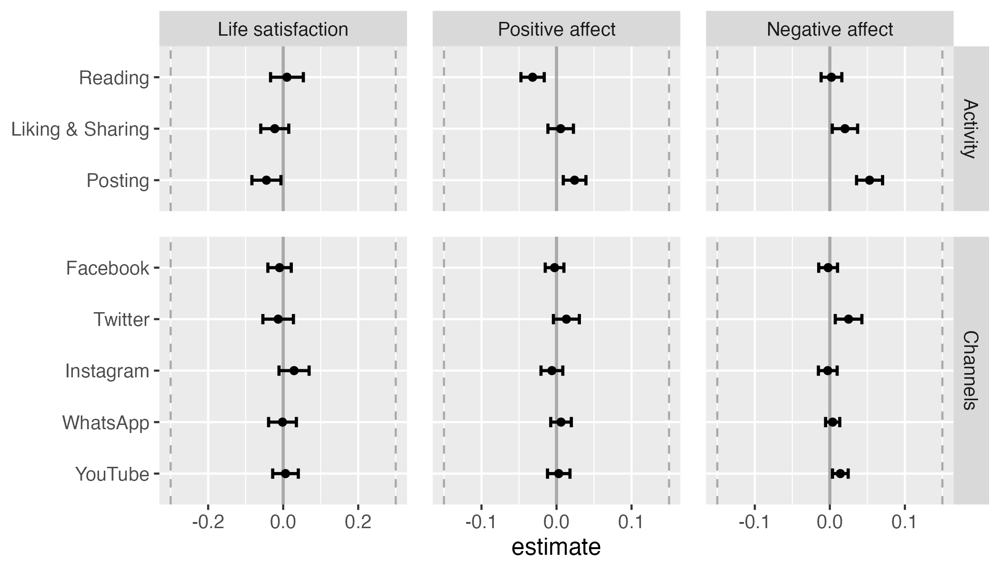

```{r analysis-preferences, include=F, cache=F}
set.seed(170819) # Seed for random number generation
knitr::opts_chunk$set(cache.extra = knitr::rand_seed,
                      cache=T, echo=F)
```

```{r setup, include=F, cache=F}

# install necessary packages
# devtools::install_github("https://github.com/tdienlin/td@v.0.0.2.5")
# devtools::install_github("https://github.com/crsh/papaja@devel")

# load packages
packages <- c("devtools", "english", "ggplot2", "gridExtra", "kableExtra", 
              "lavaan", "lme4", "lmerTest",
              "magrittr", "papaja", "semPlot", "tidyverse")
lapply(c(packages, "td"), library, character.only = TRUE)

# load workspace created from analyses.rmd to use results
load("data/workspace_1.RData")
```

During the COVID-19 pandemic, 
numerous events unfolded in quick succession and several open questions emerged.
How dangerous is the virus? 
Is it spreading in my region? 
How is it transmitted, and how can I protect myself?
Because for many it was (and at the time of writing still is) a matter of life or death, people aimed to stay informed regarding the latest developments.
Governments around the world implemented safety measures, such as wearing masks, keeping physical distance, or enforcing lockdowns.
In this extraordinary situation, many people heavily relied on media to obtain relevant information, and especially social media were at an all time high [@statistaAverageDailyTime2021].

Some people actually couldn't stop using social media to learn about COVID-19 related news.
A new phenomenon emerged, termed "doomscrolling":
Users were glued to their screens and found it hard to pursue other relevant activities such as working, taking a break, or looking after their children [@kleinDarklySoothingCompulsion2021].
It was asked whether using social media for COVID-19 related reasons is helpful, or whether it creates an additional burden on mental health [@sandstromDoomscrollingCOVIDNews2021].
These concerns seem justified: 
A study with 6,233 people from Germany conducted during the pandemic found that "[f]requency, duration and diversity of media exposure were positively associated with more symptoms of depression" [@bendauAssociationsCOVID19Related2021, p. 283].

As a result, with this study I want to build on this research and investigate whether or not COVID-19 related social media use affected well-being during the pandemic.
To this end, I analyzed a large-scale panel study from the Austrian Corona Panel Project [@kittelAustrianCoronaPanel2020]. 
The panel consists of **32** waves and has an overall sample size of **`r nrow(d_wide) %>% prettyNum(big.mark = ",")` participants**.
<!-- At least 1,500 participants took part per wave, and the sample is representative of the Austrian population. -->
The panel study collected a large number of psychological and demographic variables.
<!-- Being able to control for many confounding third variables, both stable and varying, together with the longitudinal design, this creates a unique opportunity  -->
I explicitly aimed to investigate the causal effects of COVID-19 related social media use on well-being.

## Understanding Well-being and Media Use

The underlying theories that guided the selection of variables for my analysis are the two-continua model of mental health [@greenspoonIntegrationSubjectiveWellbeing2001] and the hierarchical taxonomy of computer-mediated communication [@meierComputermediatedCommunicationSocial2020a].
According to the two-continua model, mental health consists of (a) psychopathology and (b) well-being.
<!-- Because the aim of this study is better to understand typical users and everyday contexts, my focus will be on well-being. -->
Well-being can be differentiated into subjective and psychological well-being [@dienerAdvancesOpenQuestions2018].
Whereas subjective well-being emphasizes hedonic aspects such as happiness and joy, psychological well-being addresses eudaimonic aspects such as fulfillment and meaning.
Subjective well-being is primarily about achieving positive affect and avoiding negative affect.
One of the most prominent indicators of well-being is life satisfaction.
In my view, because it represents a general appraisal of one's life, life satisfaction is best thought of as a meta concept that combines psychological and subjective well-being.
Notably, life satisfaction is stable and fluctuates only little, whereas it's the exact opposite for affect [@dienlinImpactDigitalTechnology2020].
<!-- Everyone can feel bad on any given day, but whether or not one feels generally comfortable in one's life rather changes across years. -->
To capture well-being in this study I thus build on life satisfaction, positive affect, and negative affect.
Together, this should provide an encompassing perspective on potential media effects.

The hierarchical taxonomy of computer-mediated communication differentiates six levels of how people engage with digital technology.
First, the device (e.g., smartphone); second, the type of application (e.g., social networking site); third, the branded application (e.g., Twitter); fourth, the feature (e.g., status post); fifth, the interaction (e.g., one-to-many); and sixth, the message (e.g., content) [@meierComputermediatedCommunicationSocial2020a].
Whereas the first four levels focus on the communication _channel_, the last two address the communication _type_.
**Differentiating different communication channels and communication types is important, because the effects on well-being likely differ across communication channels and communication types.**
**Whereas active social media use such as chatting is routinely linked to improved well-being, passive use such as reading is considered more negative [@dienlinImpactDigitalTechnology2020].**
Similarly, branded apps are separate entities with potentially divergent effects. 
For example, @waterlooNormsOnlineExpressions2018 found that it's more adequate to express negative emotions on WhatsApp than on Twitter or on Instagram. 
**Especially during a pandemic, it makes sense to analyze if users engage with COVID-19 related content on Instagram, where communication is more positive, or on Facebook, where communication is more critical.**

**In this study, to measure the effects of social media use focused on COVID-19 related news and topics, I adopt both the channel and the type of communication perspective.**
**Together, this should offer a nuanced and comprehensive understanding of communication.**
First, I investigate how well-being is affected by different types of communication, namely active and passive use.
Defining what constitutes active and what passive use is not always clear, and different understandings are currently discussed [@ellisonWhyWeDon2020; @meierComputermediatedCommunicationSocial2020a].
Reading is generally considered as passive and writing as active, while there are also specific behaviors such as liking or sharing content that fall somewhere in-between [@meierDoesPassiveSocial2022].
In this study, I hence distinguish (a) _reading_ (passive), (b) _posting_ (active), and (c) _liking and sharing_ COVID-19 related posts (both active and passive).
Second, I analyze how using the most prominent branded applications affects well-being, and whether this effect changes across applications.
The branded applications investigated here are Facebook, Twitter, Instagram, WhatsApp, and YouTube---which were, at the time of writing, the most relevant social media apps.

**Worth noting, this study is not about _general_ social media use during times of COVID, but on social media use _focused_ on COVID-19 related content.** 
**For example, posting thoughts about the pandemic, reading posts and comments, or retweeting COVID-19 related news.**

## Theorizing Social Media Effects on Well-Being

<!-- In conclusion, most effects are likely somewhere between trivial and small. -->
<!-- I therefore expect that also in the case of COVID-19 related social media use effects will be trivial to small. -->

From a theoretical perspective, how could we explain whether COVID-19 related social media use affects well-being?
<!-- In what follows, I outline potential arguments as to why the effect might be positive or negative, direct or indirect, or nonexistent. -->
According to the set-point model of subjective well-being, well-being is surprisingly stable [@lykkenHappinessWhatStudies1999].
Although specific events such as marriage or salary can have significant effects, after some time well-being routinely returns to prior levels, which are mostly determined genetically [@sheldonStabilityHappinessTheories2014].
Only very specific events and factors such as unemployment, disability, or death can cause long-term changes in well-being [@lucasAdaptationSetpointModel2007].
<!-- So although well-being can change this does not happen easily. -->
<!-- Although the set-point theory has been criticized lately because events such as marriage, unemployment, or death can indeed lead to long-term changes, it is still widely maintained that well-being is very stable and hence hard to be influenced  -->

Can media use be such a factor?
In advance, there doesn't seem to be a clear winner, and it's likely that both positive and negative effects cancel each other out.
Empirically, social media use on average does not have a strong effect on well-being [@meierComputermediatedCommunicationSocial2020a].
According to the Differential Susceptibility to Media Effects Model [@valkenburgDifferentialSusceptibilityMedia2013], the effects of media use differ across individuals **and content**.
Whereas for some media are beneficial, for others they are harmful.
**Whereas some content provides opportunities (education, advice), other content creates risks (misinformation, hate). [@livingstoneEuropeanResearchChildren2018].**
Social media can impair well-being when causing embarrassment, stress, or disinformation, and they can improve well-being when providing connectedness, information, or entertainment [@buchiDigitalWellbeingTheory2021].
On average, however, effects are often small or negligible.

**Two of the most prominent media effect theories argue (indirectly) against strong average negative impacts.**
**According to mood management theory [@zillmannMoodManagementCommunication1988], using media substantially affects people's moods.**
**Effects can be stimulating or overwhelming, relaxing or boring.**
**After some time, users implicitly learn what media help them balance their mood and affect according to their own situational needs [@zillmannMoodManagementCommunication1988].**
**Those media that eventually become part of one's media repertoire are hence, on average, beneficial for users and their moods.**
**Using experience sampling of well-being and logs of social media use, a study with 82 participants from Italy found that after episodes of social media use, levels of positive affect increased significantly [@marcianoDynamicsAdolescentsSmartphone2022].**

**While mood management theory considers media use mainly driven by implicit learning experiences, uses and gratifications theory upholds that the process is more explicit and rational [@katzUsesGratificationsResearch1973].**
**Users select those media that they expect to have a desired effect, for example on mood, knowledge, or entertainment.** 
**If those beneficial media effects do not exist or if they are not expected, people will spend their time elsewhere.**
**And social media offer several beneficial effects, explaining why they are used that much.**
**They help find relevant information, maintain and foster relationships, express one's personality, and entertain oneself [@pelletierOneSizeDoesn2020].**
**In conclusion, because people spend so much time on social media consuming COVID-19 related content, according to both mood management theory and uses and gratifications theory we wouldn't expect to find strong average negative effects.**

But people can also misjudge media effects and are often overly optimistic [@metzgerComparativeOptimismPrivacy2017].
And precisely because social media have so many positive consequences, one can ask if this is not where the actual problem lies.
In other words, social media aren't problematic because they're inherently bad, but rather because they're too good.
And as with many other things, there can be too much of a good thing.
It is therefore often asked whether social media are addictive, and users sometimes express this fear themselves [@yangCanWatchingOnline2021]. 
However, a recently published meta-analysis found that the two most prominent measures of addiction, the Bergen Facebook Addiction Scale and the Bergen Social Media Addiction Scale, have only small relations to well-being [@duradoniWellbeingSocialMedia2020]. 
In addition, the general idea of labeling excessive social and new media use as addiction was criticized, arguing that social media represent new regular behaviors that should not be pathologized [@galerHowMuchToo2018; @vanrooijWeakScientificBasis2018].

**Because media effects can differ across users, situations, and content [@livingstoneEuropeanResearchChildren2018; @valkenburgDifferentialSusceptibilityMedia2013], I now briefly focus on the effects of COVID-19 related social media use specifically.**
First, one could assume a _direct_ negative effect on well-being, and especially on positive or negative affect, which are more volatile and fluctuating.
Dangers, inequalities, corruption---these were the headlines during the pandemic across many countries worldwide.
If one learns about such events, the initial reaction might be shock, fear, or dismay.
Consuming such news can be depressing [@dornemannHowGoodBad2021], perhaps even changing some general perspectives on life.
<!-- So, just like being hit by a hammer hurts and we don't need any "mediating mechanism", this could be the case here as well. -->
That said, because not all news was negative, and because many people showed solidarity and compassion, there was also positive and uplifting content, potentially compensating for the negative effects [@dornemannHowGoodBad2021].
A study with 2.057 respondents from Italy reported that during the pandemic virtual community and social connectedness even increased during the pandemic [@guazziniSecondWaveAnalysis2022].
**In Finland, in a sample of 735 participants, levels of loneliness did not decrease during the pandemic, and people who engaged more on social media showed less loneliness [@latikkaLonelinessPsychologicalDistress2022].**
<!-- However, in light of a worldwide pandemic with millions of deaths, the negative direct effect seems more plausible. -->

There could also be _indirect_ effects.
When browsing social media for COVID-19 related news, many users reported being captivated to such an extent that they could not stop using social media [@kleinDarklySoothingCompulsion2021].
During the pandemic social media use was at an all-time high in the US [@statistaAverageDailyTime2021].
Although it is most likely that moderate social media use is not detrimental [@orbenTeenagersScreensSocial2020], overuse, however, might be more critical, and several studies have shown more pronounced negative effects for extreme users [@przybylskiLargescaleTestGoldilocks2017].
To explain, overuse could impair well-being if it replaces meaningful or functional activities such as meeting others, working, actively relaxing, or exercising.
**Another potentially negative mechanism at play are problematic social comparison processes. During the pandemic, several users shared how they successfully dealt with challenges such as physical distancing. In a study with 1131 residents from Wuhan in China [@yuePassiveSocialMedia2022], people who spent more time in quarantine also spent more time on social media. Those, who spent more time on social media also engaged in more upward social comparison, which was related to increased levels of stress.**
<!-- Therefore, if a society collectively overuses social media during a pandemic, there is potential for negative effects. -->
<!-- If overuse replaces such activities it's reasonable to assume that it's also detrimental. -->

On the other hand, one can make the case that using social media for COVID-19 related reasons might even be beneficial, especially in times of a pandemic.
Exchanging COVID-19 related messages with friends via WhatsApp might replace the in-person contact one would have otherwise, but which is literally impossible at the time.
In situations where meaningful and functional activities are prohibited, using social media to exchange about COVID-19 related topics might not be the worst idea.
Besides, given that nowadays a large number of experts, scientists, and politicians converse directly on social media, one can get first-hand high quality information on current developments.
<!-- On the other hand, there is of course also much disinformation, and "bingeing" on COVID-19 fake news might also pose risks for impaired well-being. -->

To summarize, from a theoretical perspective it is most likely that the average effects of social media use on well-being are negligible. 
Building on established theories from Communication, we would not assume that effects are either profoundly negative or strongly positive.

## Empirical Studies on Social Media Effects

So far, there is only little empirical research on how well-being is affected by COVID-19 related social media.
In their study on the relations between media use and mental health during the pandemic, @bendauAssociationsCOVID19Related2021 found that people who used social media as a primary source of information reported on average "significantly more unspecific anxiety and depression [] and significantly more specific COVID-19 related anxiety symptoms" (p. 288).
@edenMediaCopingCOVID192020 analyzed the media use of 425 US college students during the first wave of the pandemic, finding both positive and negative relations with well-being.
In a sample of 312 respondents collected via Amazon Mechanical Turk, @choiMediatedCommunicationMatters2021 reported that people who used media to attain information were more lonely and less satisfied with their lives.
@stainbackCOVID1924News2020 analyzed a large-scale study with 11,537 respondents from the US and found that increased COVID-19 media consumption was related to more psychological distress.
A four-wave panel study with 384 young adults from the U.S. analyzed the effects of general digital technology use---objectively measured via screenshots of screen-time applications---on mental health, separating within- and between-person relations [@sewallObjectivelyMeasuredDigital2021].
The results showed that digital technology did not have any significant effects on mental health [for a similar study with comparable results, see @bradleyStressMoodSmartphone2021].
Together, the literature is mixed, with a slight focus on the negative effects of social media as news use [see also @dornemannHowGoodBad2021; @liuRelationOfficialWhatsAppdistributed2020; @riehmAssociationsMediaExposure2020].
However, note that all of these findings represent between-person relations stemming from cross-sectional data (see below).
We therefore don't know whether the differences in mental health and well-being are due to social media use or due to other third variables, such as age, health, employment, or education.

The question of whether and how social media use affects well-being _in general_, on the other hand, is well-researched.
This also holds true for the different types of communication such as active or passive use.
A meta review (i.e., an analysis of meta-analyses) found that the relation between social media use and well-being is likely in the negative spectrum but very small [@meierComputermediatedCommunicationSocial2020a]---potentially too small to matter.
What determines whether or not an effect is considered small or trivial?
As a starting point, we could refer to standardized effect sizes.
According to @cohenPowerPrimer1992, small effect sizes start at _r_ = .10.
And indeed, several if not most of the current meta-analyses find effect sizes below that threshold [@huangTimeSpentSocial2017; @meierComputermediatedCommunicationSocial2020a; @fergusonThisMetaanalysisScreen2021].

Finally, also several individual studies employing advanced methods found smalls relations between social media use and well-being [@orbenSocialMediaEnduring2019; @przybylskiDoesTakingShort2021a; @schemerImpactInternetSocial2021; @kerestesAdolescentsOnlineSocial2020].
For example, @beyensSocialMediaUse2021 reported that although for some users (roughly one quarter) the effects of social media use on well-being were negative, for almost the same number of users they were positive, while for the rest the effects were neutral.
This finding is aligned with the Differential Susceptibility to Media Effects Model: 
Although there is substantial _variation_ of media effects for individual users, the _average_ effects reported in the literature are often small [@valkenburgDifferentialSusceptibilityMedia2013]. 

<!-- Together, the strongest argument to me is that _in general_ the effects of social media on well-being are, on average, small at best.  -->
<!-- Because this study only looks at _one part_ of social media use---namely, COVID-19 related interactions---it is very focused, diminishing the overall potential of the effects even further. -->
<!-- Whether or not using social media for COVID-19 related aspects is detrimental during a pandemic is also not entirely clear. -->
<!-- At least, there does not seem to be a case where we should expect a clear deviation to the negative, despite anecdotes of doomscrolling. -->

In conclusion, in light of the theoretical considerations and empirical studies presented above, I expect that COVID-19 related communication on social media doesn't affect well-being in a meaningful or relevant way.
**This general hypothesis will be analyzed specifically for the communication types of (a) time spent reading, (b) liking and sharing, and (c) actively posting COVID-19 related content.**
**In addition, I will analyze how well-being is influenced by spending time on five prominent social media apps, including (a) Facebook, (b) Instagram, (c) Twitter, (d) WhatsApp, and (e) YouTube.** 
**Three different well-being indicators will be differentiated: life satisfaction, positive affect, and negative affect.**

> Hypothesis: The within-person effects of all types of COVID-19 related social media use on all types of well-being indicators---while controlling for several stable and varying covariates such as sociodemographic variables and psychological dispositions---will be trivial.

# Current Study
## Smallest Effect Size of Interest

Testing this hypothesis, however, is not trivial.
First, in contrast to most hypotheses typically posited in the social sciences it implicitly contains an effect size, a so-called smallest effect size of interest (SESOI).
Effectively testing this hypothesis necessitates defining what's considered a "trivial effect size" and what's not.
Above I already referred to standardized effect sizes.
However, standardized effect sizes should only be a first step toward evaluating an effect's relevance [@baguleyStandardizedSimpleEffect2009].
Standardized effect sizes are determined by a sample's variance,[^cohensd] which is problematic: 
The question of whether or not social media use affects a particular person in a relevant way should not depend on the variance in the sample in which that person's data were collected.
Instead, it should depend on absolute criteria.

What could be a minimally interesting, nontrivial effect?
Because this is a normative and ultimately philosophical question, there can never be a clear, single, or unanimous answer. 
<!-- In the end, it is a personal question. -->
However, it is still necessary and helpful to try to provide such a plausible benchmark. 
I therefore suggest the following SESOI for this research question:

[^cohensd]: Consider the effect size Cohen's _d_: The mean's of the two groups that are to be compared are subtracted from one another and then divided by the sample's standard deviation [@cohenPowerPrimer1992]. Hence, if there is more deviation/variance in a sample, the effect size decreases, even if the difference of the group's means stays the same.

> SESOI: If a heavy user of COVID-19 related social media news suddenly _stops_ using social media altogether, this should have a _noticeable_ impact on their overall well-being.

What does this mean practically and how can it be operationalized?
In this study, COVID-19 related social media use was measured on a 5-point scale, ranging from 1 = _never_ to 5 = _several times a day_. 
Thus, a change of four units in social media use (e.g., a complete stop) should correspond to a noticeable change in well-being.
But what's a noticeable change in well-being?
According to @normanInterpretationChangesHealthrelated2003, people can reliably distinguish _seven_ levels of satisfaction with health.
So if satisfaction is measured on a 7-point scale, we would state that a four unit change in social media use should result in a one unit change in life satisfaction. 
(For more information, see Methods section "Inference Criteria.")

## Causality

The hypothesis explicitly states a causal effect.
In non-experimental studies, longitudinal designs can help investigate causality.
Using longitudinal designs alone, however, is not sufficient for establishing correct causal statements [@rohrerTheseAreNot2021].
In addition, we for example also need to control for confounding third variables.
**Importantly, when analyzing longitudinal (within-person) relationships and effects, it is important to control for _varying_ third variables.**
**Non-varying third variables only help control non-varying (between-person) relations.**

To illustrate, consider the following example.
Imagine that a person suddenly starts using social media much more than usual, and then after some time  becomes less satisfied with their life.
Eventually, use and life satisfaction return to prior levels.
If this happens to several people at the same time, in a longitudinal study we could then observe a significant effect of social media use on life satisfaction.
However, it could also be the case that during the study there was a major exogenous event (say, a pandemic), which caused large parts of the working population to loose their jobs.
Hence, the causal effect reported above was confounded, because in reality it was the pandemic that caused both social media use to rise and life satisfaction to go down.

Thus, only when controlling for _all_ relevant confounders, can we correctly estimate causality without bias [@rohrerThinkingClearlyCorrelations2018].
Obviously, we can never be entirely sure to have included all confounders, which makes absolute statements regarding causality virtually impossible.
In addition, when determining the overall causal effect, we need to make sure _not_ to control for mediating variables [@rohrerThinkingClearlyCorrelations2018], for doing so would bias our assessment of the causal effect.
Complicating matters further, it is often unclear if a variable is a mediator or a confounder.[^collider]
However, despite all these caveats, when controlling for relevant variables (that aren't mediators), we can be much more certain that we measured causality correctly.
The aim should therefore be to collect as many varying and non-varying confounders as possible (which I believe is seldom done in our field), while knowing that absolute certainty regarding causality cannot be reached.

[^collider]: In addition, there also exist colliders, which I don't discuss here and which complicate the issue even further [@rohrerThinkingClearlyCorrelations2018].

When searching for suitable candidates for confounders, we should look for variables that affect both media use and well-being. 
Controlling for these factors isolates the actual effect of social media use on well-being.
We can also control for variables that affect only social media use or well-being. 
However, in doing so not much is gained or lost, because the effects of social media use would remain virtually the same [@klinePrinciplesPracticeStructural2016; but see @mcelreathYesterdayClass2021].

In this study, I hence plan to control for the following variables, which either have already been shown to affect both social media use and well-being or which are likely to do so, and which also aren't mediators:
<!-- (I'll additionally include variables that likely affect only well-being, also to obtain a comparison benchmark for social media effects): -->
gender, age, education, Austria country of birth, Austria country of birth of parents, text-based news consumption, video-based news consumption, residency Vienna, household size, health, living space, access to garden, access to balcony, employment, work hours per week, being in home-office, household income, outdoor activities, satisfaction with democracy, disposition to take risks, and locus of control.[^explore]
<!-- I will not control for variables such as trust in institutions or trust in media, because these variables might be influenced by social media use to a meaningful extent. -->

[^explore]: The data-set includes many other variables that one could also potentially control for, and I invite interested readers to download the and explore potential interesting relationships.

Next to including covariates, it's now increasingly understood that causal effects should be analyzed from an internal, within-person perspective [@hamakerWhyResearchersShould2014].
If a specific person changes their media diet, we need to measure how this behavior affects _their own_ well-being.
Between-person comparisons from cross-sectional data, where participants are interviewed only once, cannot provide such insights.
In this study, I hence differentiate between-person relations from within-person effects. 
And as explicated above, to test the hypothesis I thus consider only the within-person effects.

Finally, one precondition of causality is temporal order. 
The cause needs to precede the effect.
Finding the right interval between cause and effect is crucial.
For example, if we want to understand the effect of alcohol consumption on driving performance, it makes a big difference if driving performance is measured one minute, one hour, one day, or one week after consumption.
<!-- Finding the right interval is difficult. -->
If variables are stable, longer intervals are needed; if they fluctuate, shorter intervals.
In the case of well-being, we need shorter intervals for **the more fluctuating** positive and negative affect and longer ones for **the more stable** life satisfaction [@dienlinImpactDigitalTechnology2020].
**Using social media can have instant effects on mood [@marcianoDynamicsAdolescentsSmartphone2022].**
**Effects on life satisfaction often take longer to manifest, for example because media use leads to actual changes in specific behaviors, which then affect life satisfaction [@dienlinDisplacementReinforcementReciprocity2017].**
Choosing the right interval is challenging, because especially short intervals are hard to implement in practice, often requiring advanced methods such as experience sampling (also known as in situ measurement or ambulant assessment) [@schnauber-stockmannMobileDevicesTools2020].
In this study, I hence analyze how using social media during the last week affected positive and negative affect during the same week.
In other words, if people during the last week engaged in more COVID-19 related social media use than they usually do, did they feel better or worse during that week than they usually do?
Regarding life satisfaction, I implemented a longer interval.
If people during the last week used COVID-19 related social media more than they usually do, were they at the end of the week more or less satisfied with their lives than they usually are?
I hence analyze if when a person changes their social media diet, are there (a) _simultaneous_ changes in their affect and (b) _subsequent_ changes in their life satisfaction?
**These relations will be controlled for varying confounders, which fosters a causal interpretation.**
Similar approaches were implemented by other studies [@johannesNoEffectDifferent2022; @scharkowHowSocialNetwork2020], and they are considered a best practice approach toward analyzing causality [@bellFixedRandomEffects2019].

# Method

In this section I describe the preregistration and how I determined the sample size, data exclusions, the analyses, and all measures in the study.

## Preregistration

The hypotheses, the sample, the measures, the analyses, and the inference criteria (SESOI, p-value) were preregistered on the Open Science Framework. 
The (anonymous) preregistration can be accessed here: https://osf.io/87b24/?view_only=b2289b6fec214fa88ee75a18d45c18f3.
Because in this study I analyzed data from an already existing large-scale data set, all of these steps were done prior to accessing the data.
The preregistration was designed on the basis of the panel documentation online [@kittelAustrianCoronaPanel2020].
In some cases I couldn't execute the analyses as I had originally planned, for example because some properties of the variables only became apparent when inspecting the actual data.
The most relevant deviations are reported below, and a complete list of all changes can be found in the online [companion website](https://XMtRA.github.io/Austrian_Corona_Panel_Project) (https://XMtRA.github.io/Austrian_Corona_Panel_Project).

## Sample

**The data come from the Austrian Corona Panel Project [@kittelAustrianCoronaPanel2021], which is a large-scale standalone panel study. **
**The data are hosted on AUSSDA and are publicly available here: https://doi.org/10.11587/28KQNS.**
**At the time of writing, the official website included a data-set consisting of 24 waves. **
**For the analyses presented here, I was able to receive an advance version consisting of all 32 waves.**
**The study was conducted between March 2020 and June 2022, and data collection is now officially finished.**
**It contains 32 waves.**
Between March 2020 and July 2020, the intervals were weekly, and afterward the intervals were monthly.
Each wave consists of at least 1,500 respondents.
The overall sample size was _N_ = `r d_raw %>% nrow() %>% prettyNum(big.mark = ",")`, and `r d_long %>% nrow() %>% prettyNum(big.mark = ",")` observations were collected.
Panel mortality was compensated through a continuous acquisition of new participants. 
All respondents needed to have access to the internet (via computer or mobile devices such as smartphones or tablets).
They were sampled from a pre-existing online access panel provided by the company Marketagent, Austria.
Respondents were asked and incentivized with 180 credit points to participate in each wave of the panel.

Achieved via quota sampling, the sample matched the Austrian population in terms of age, gender, region/state, municipality size, and educational level.
In order to participate in the study, the respondents needed to be Austrian residents and had to be at least 14 years of age. 
Ethical review and approval was not required for the study in accordance with the local legislation and institutional requirements. 
The participants provided their written informed consent to participate in this study.
The average age was `r mean(2021 - d_wide$year_birth, na.rm = T) %>% round(0)` years, `r mean(d_wide$male, na.rm = T) %>% round(., 2) * 100` percent were male, `r (d_wide %>% filter(.$edu_fac %in% c("State college", "Bachelor", "Master", "PhD"))) %>% nrow() %>% divide_by(sum(table(d_wide$edu_fac))) %>% multiply_by(100) %>% round(0)` percent had a University degree, and `r (table(d_wide$employment_fac)["Unemployed"] / sum(table(d_wide$employment_fac))) %>% unname() %>% multiply_by(100) %>% round(., digits = 0)` percent were currently unemployed.

## Inference Criteria

Because the data were analyzed post-hoc, no a-priori sample size planning on the basis of power analyses was conducted.
The sample is large, and it is hence well-equipped to reliably detect small effects.
<!-- , which is why no exact post hoc power analysis were conducted. -->
In addition, because such large samples easily generate significant _p_-values even for very small effects, it helps that the hypotheses were tested with a smallest effect size of interest-approach.
To this end, I adopted the interval testing approach as proposed by @dienesUsingBayesGet2014.
On the basis of the SESOI, I then defined a null region.
In what follows, I explain how I determined the SESOI and the null region.

In this study, life satisfaction was measured on an 11-point scale.
If people can reliably differentiate 7 levels as mentioned above, this corresponds to 11 / 7 = `r round(11/7, 2)` unit change on an 11-point scale.
Hence, a four-point change in media use (e.g., a complete stop) should result in a `r round(11/7, 2)`-point change in life satisfaction.
In a statistical regression analysis, _b_ estimates the change in the dependent variable if the independent variable increases by one point.
We would therefore expect a SESOI of _b_ = `r round(11/7, 2)` / 4 = `r round(11/7*.25, 2)`.
For affect, which was measured on a 5-point scale, our SESOI would be _b_ = `r round(5 / 7, 2)` / 4 = `r round(5 / 7 * .25, 2)`.
Because we're agnostic as to whether the effects are positive or negative, the null region includes negative and positive effects.
Finally, in order not to exaggerate precision and to be less conservative, these numbers are reduced to nearby thresholds.[^rounding] 
Together, this leads to a null region ranging from _b_ = -.30 to _b_ = .30 for life satisfaction, and _b_ = -.15 to _b_ = .15 for positive and negative affect.

[^rounding]: Note that other researchers also decreased or recommended decreasing thresholds for effect sizes when analyzing within-person or cumulative effects [@beyensSocialMediaUse2021; @funderEvaluatingEffectSize2019].

<!-- As explained above, for well-being the null region was between _b_ = -.30 and _b_ = .30 (i.e., _b_ = |.30|). -->
Let's briefly illustrate what this means in practice.
If the 95% confidence interval falls completely within the null-region (e.g., _b_ = .20, [95% CI: .15, .25]), the hypothesis that the effect is trivial is supported.
If the confidence interval and the null region overlap (e.g., _b_ = .30, [95% CI: .25, .35]), the hypothesis is not supported and the results are considered inconclusive, while a meaningful negative effect is rejected.
If the confidence interval falls completely outside of the null-region (e.g., _b_ = .40, [95% CI: .35, .45]), the hypothesis is rejected and the existence of a meaningful positive effect is supported.
For an illustration, see Figure \@ref(fig:sesoi)).

<!-- Responses were individually checked for patterns such as straight-lining or missing of inverted items. -->
<!-- X clear cases were removed. -->

## Data Analysis

The hypothesis was analyzed using mixed effects models, namely random effect within-between models (REWB)[@bellFixedRandomEffects2019]. 
Three models were run, one for each dependent variable.
The data were hierarchical, and responses were separately nested in participants and waves (i.e., participants and waves were implemented as random effects).
Nesting in participants allowed to separate between-person relations from within-person effects.
Nesting in waves allowed to control for general exogenous developments, such as general decreases in well-being in the population, for example due to lockdown measures.
Thus, there was no need additionally to control for specific phases or measures of the lockdown.
Predictors were modeled as fixed effects.
They included social media communication types and channels, separated into within and between-person factors, as well as stable and varying covariates.
All predictors were included simultaneously and in each of the three models. 

The factorial validity of the scales were tested with confirmatory factor analyses (CFA).
Because Mardia’s test showed that the assumption of multivariate normality was violated, I used the more robust Satorra-Bentler scaled and mean-adjusted test statistic (MLM) as estimator.
To avoid over-fitting, I tested the scales on more liberal fit criteria (CFI > .90, TLI > .90, RMSEA <. .10, SRMR < .10) [@klinePrinciplesPracticeStructural2016].
<!-- Finally, REWB-models cannot model latent variables. -->
<!-- To increase precision, I therefore exported factor scores from the CFAs for positive and negative affect. -->
Mean scores were used for positive and negative affect.
<!-- Respondents who answered less than 50% of all questions were removed. -->
**Missing responses were imputed using multiple imputation with predictive mean matching (five iterations, five data-sets), including categorical variables.**
**All variables were imputed except the media use measures, as they were not collected on each wave.**
**All variables included in the analyses presented here were used to impute missing data.**
**For the main analyses, results were pooled across all five data-sets.**

For more information on the analyses, a complete documentation of the models and results, additional analyses (for example using multiple imputation or no imputation), see [companion website](https://XMtRA.github.io/Austrian_Corona_Panel_Project).

## Measures

In what follows, I list all the variables that I analyzed.
For the variables' means, range, and variance, see Table \@ref(tab:tab-descriptives).
For a complete list of all items and item characteristics, see [companion website](https://XMtRA.github.io/Austrian_Corona_Panel_Project).

### Well-being

Life satisfaction was measured with the item "All things considered, how satisfied are you with your life as a whole nowadays?" from the European Social Survey [@europeansocialsurveyESS9Edition20182021].
The response options ranged from 0 (_extremely dissatisfied_) to 10 (_extremely satisfied_).

To capture positive affect, respondents were asked how often in the last week they felt (a) calm and relaxed, (b) happy, and (c) full of energy [@worldhealthorganizationWellbeingMeasuresPrimary1998].
The response options were 1 (_never_), 2 (_on some days_), 3 (_several times per week_), 4 (_almost every day_), and 5 (_daily_).
The scale showed good factorial fit, `r fit_txt(cfa_aff_pos)`.
Reliability was high, $\omega$ = `r rel_aff_pos %>% my_round("std")`.

For negative affect, respondents were asked how often in the last week they felt (a) lonely, (b) aggravated, (c) so depressed, that nothing could lift you up, (d) very nervous, (e) anxious, and (h) glum and sad [@worldhealthorganizationWellbeingMeasuresPrimary1998].
The response options were 1 (_never_), 2 (_on some days_), 3 (_several times per week_), 4 (_almost every day_), and 5 (_daily_).
The scale showed good factorial fit, `r fit_txt(cfa_aff_neg)`.
Reliability was high, $\omega$ = `r rel_aff_neg %>% my_round("std")`.

All three variables were measured on each wave.

### COVID-19 related social media use

COVID-19 related social media use focused on communication types was measured with the three dimensions of (a) reading, (b) liking and sharing, and (c) posting.
The items come from @wagnerAUTNESOnlinePanel2018 and were adapted for the context of this study.
The general introductory question was "How often during the last week have you engaged in the following activities on social media?"
The three items were "Reading the posts of others with content on the Coronavirus", "When seeing posts on the Coronavirus, I clicked 'like', 'share' or 'retweet'", "I myself wrote posts on the Coronavirus on social media."
Answer options were 1 (_several times per day_), 2 (_daily_), 3 (_several times per week_), 4 (_weekly_), 5 (_never_).
The items were inverted for the analyses.

COVID-19 related social media use focused on channels was measured with five variables from @wagnerAUTNESOnlinePanel2018, adapted for this study. 
The general introductory question was "How often in the last week have you followed information related to the Corona-crisis on the following social media?"
The five items were (a) Facebook, (b) Twitter, (c) Instagram, (d) Youtube, and (e) WhatsApp.
Again, the answer options were 1 (_several times per day_), 2 (_daily_), 3 (_several times per week_), 4 (_weekly_), 5 (_never_).
Again, the items were inverted for the analyses.

Social media use was measured for all participants on waves 1, 2, 8, 17, 23, **and 28**.
Freshly recruited respondents always answered all questions on social media use.

### Control variables

The effects of COVID-19 related social media use were controlled for the following stable variables: 
(a) gender (female, male, diverse), (b) age, (c) education (ten options), (d) Austria country of birth (yes/no), (e) Austria parents' country of birth (no parent, one parent, both parents).
I originally planned to implement additional variables as varying covariates.
However, because they were not measured often enough or not at the time when social media use was measured, I implemented them as stable variables using their average values across all waves.
This includes (a) text-based media news consumption (five degrees), (b) video-based media news consumption (five degrees), (c) residency is Vienna (yes/no), (d) self-reported physical health (five degrees), (e) living space (eleven options), (f) access to balcony (yes/no), (g) access to garden (yes/no), (h) employment (nine options), (i) disposition to take risks (eleven degrees), and (j) locus of control (five degrees).
I also controlled for the following varying covariates: (a) five items measuring outdoor activities such as sport or meeting friends (five degrees), and (b) satisfaction with democracy (five degrees).
Because it lead to too much attrition in the sample, I did not control for (a) household size, (b) work hours per week, (c) home office, (d) household income.

# Results

First, when looking at the variables from a descriptive perspective (Figure \@ref(fig:fig-descriptives)), we see that all well-being measures did not change substantially across the different waves of data collection.
COVID-19 related media use, however, decreased slightly at the beginning of the study and remained stable after approximately six waves.
The initial decrease might be explained by the fact that the collection of data began at the end of March 2020, hence approximately three months after the pandemic began.
It could be that after an initial uptick, COVID-19 related social media use was already declining at the time, returning to more normal levels.

## Preregistered Analyses

The study's main hypothesis was that the effects of social media use on well-being would be trivial.
Regarding the effects of different communication _types_---that is, reading vs. sharing vs. posting---all within-person effects fell completely within the a-priori defined null region (see Figure \@ref(fig:fig-between)).
For example, respondents who used social media more frequently than usual to read about COVID-19 related topics did not show a simultaneous change in life satisfaction (_b_ = `r dat_fig_results_within %>% filter(dv == "Life satisfaction" & iv == "Reading" & type == "within" & Analysis == "Regular") %>% select(estimate) %>% round(2)` [95% CI `r dat_fig_results_within %>% filter(dv == "Life satisfaction" & iv == "Reading" & type == "within" & Analysis == "Regular") %>% select(conf.low) %>% round(2)`, `r dat_fig_results_within %>% filter(dv == "Life satisfaction" & iv == "Reading" & type == "within" & Analysis == "Regular") %>% select(conf.high) %>% round(2)`]).
As a result, the hypothesis was supported for all COVID-19 related types of social media communication.
**However, two effects were statistically significantly different from zero.**
**Users who wrote more COVID-19 related posts than usual were also slightly less satisfied with their lives as usual (_b_ = `r dat_fig_results_within %>% filter(dv == "Life satisfaction" & iv == "Posting" & type == "within" & Analysis == "Regular") %>% select(estimate) %>% round(2)` [95% CI `r dat_fig_results_within %>% filter(dv == "Life satisfaction" & iv == "Posting" & type == "within" & Analysis == "Regular") %>% select(conf.low) %>% round(2)`, `r dat_fig_results_within %>% filter(dv == "Life satisfaction" & iv == "Posting" & type == "within" & Analysis == "Regular") %>% select(conf.high) %>% round(2)`]).**
**Users who wrote more COVID-19 related posts than usual also experienced slightly more negative affect than usual (_b_ = `r dat_fig_results_within %>% filter(dv == "Negative affect" & iv == "Posting" & type == "within" & Analysis == "Regular") %>% select(estimate) %>% round(2)` [95% CI `r dat_fig_results_within %>% filter(dv == "Negative affect" & iv == "Posting" & type == "within" & Analysis == "Regular") %>% select(conf.low) %>% round(2)`, `r dat_fig_results_within %>% filter(dv == "Negative affect" & iv == "Posting" & type == "within" & Analysis == "Regular") %>% select(conf.high) %>% round(2)`]).**
**There was a small and statistically non-significant trend that reading COVID-19 related content slightly increased life satisfaction (_b_ = `r dat_fig_results_within %>% filter(dv == "Life satisfaction" & iv == "Reading" & type == "within" & Analysis == "Regular") %>% select(estimate) %>% round(2)` [95% CI `r dat_fig_results_within %>% filter(dv == "Life satisfaction" & iv == "Reading" & type == "within" & Analysis == "Regular") %>% select(conf.low) %>% round(2)`, `r dat_fig_results_within %>% filter(dv == "Life satisfaction" & iv == "Reading" & type == "within" & Analysis == "Regular") %>% select(conf.high) %>% round(2)`], _p_ = `r dat_fig_results_within %>% filter(dv == "Life satisfaction" & iv == "Reading" & type == "within" & Analysis == "Regular") %>% select(p.value) %>% my_round("p")`).**
**At the same time, there was also a small and statistically non-significant trend that reading COVID-19 related content decreased positive affect (_b_ = `r dat_fig_results_within %>% filter(dv == "Positive affect" & iv == "Reading" & type == "within" & Analysis == "Regular") %>% select(estimate) %>% round(2)` [95% CI `r dat_fig_results_within %>% filter(dv == "Positive affect" & iv == "Reading" & type == "within" & Analysis == "Regular") %>% select(conf.low) %>% round(2)`, `r dat_fig_results_within %>% filter(dv == "Positive affect" & iv == "Reading" & type == "within" & Analysis == "Regular") %>% select(conf.high) %>% round(2)`], _p_ = `r dat_fig_results_within %>% filter(dv == "Positive affect" & iv == "Reading" & type == "within" & Analysis == "Regular") %>% select(p.value) %>% my_round("p")`).**

Regarding the COVID-19 related use of social media _channels_, the results were comparable (see Figure \@ref(fig:fig-within)).
Changes in the frequency of using different social media channels to attain information regarding COVID-19 were unrelated to meaningful changes in well-being.
For example, respondents who used Facebook more frequently than usual to learn about COVID-19 did not show a simultaneous change in well-being (_b_ = `r dat_fig_results_within %>% filter(dv == "Life satisfaction" & iv == "Facebook" & type == "within" & Analysis == "Regular") %>% select(estimate) %>% round(2)` [95% CI `r dat_fig_results_within %>% filter(dv == "Life satisfaction" & iv == "Facebook" & type == "within" & Analysis == "Regular") %>% select(conf.low) %>% round(2)`, `r dat_fig_results_within %>% filter(dv == "Life satisfaction" & iv == "Facebook" & type == "within" & Analysis == "Regular") %>% select(conf.high) %>% round(2)`]).
In sum, the hypothesis was supported also for the COVID-19 related use of important social media channels.
**However, two effects differed substantially from zero.**
**Respondents who used Instagram more frequently than usual to attain COVID-19 related news reported slightly _lower_ levels of negative affect than usual (_b_ = `r dat_fig_results_within %>% filter(dv == "Negative affect" & iv == "Instagram" & type == "within" & Analysis == "Regular") %>% select(estimate) %>% my_round("b")` [95% CI `r dat_fig_results_within %>% filter(dv == "Negative affect" & iv == "Instagram" & type == "within" & Analysis == "Regular") %>% select(conf.low) %>% my_round("b")`, `r dat_fig_results_within %>% filter(dv == "Negative affect" & iv == "Instagram" & type == "within" & Analysis == "Regular") %>% select(conf.high) %>% my_round("b")`]).**
**Respondents who used YouTube more frequently than usual to attain COVID-19 related news reported slightly _higher_ levels of negative affect than usual (_b_ = `r dat_fig_results_within %>% filter(dv == "Negative affect" & iv == "YouTube" & type == "within" & Analysis == "Regular") %>% select(estimate) %>% round(2)` [95% CI `r dat_fig_results_within %>% filter(dv == "Negative affect" & iv == "YouTube" & type == "within" & Analysis == "Regular") %>% select(conf.low) %>% round(2)`, `r dat_fig_results_within %>% filter(dv == "Negative affect" & iv == "YouTube" & type == "within" & Analysis == "Regular") %>% select(conf.high) %>% my_round("b")`]).**
**However, both effects were still completely inside of the null region, hence not large enough to be considered meaningful.**

**For an overview of all within-person effects, see Table \@ref(tab:tab-within) and Figure \@ref(fig:fig-within).**

## Exploratory Analyses

In what follows, I briefly report some exploratory analyses that weren't preregistered.

### Between-person relations

For between-person relations, no a-priori hypotheses were formulated.
Results showed that no relation crossed or was completely outside of the SESOI.
Four relations were statistically significant.
**Respondents who across all waves used social media more frequently than others to read about COVID-19 related posts reported slightly lower levels of positive affect than others (_b_ `r dat_fig_results_between %>% filter(dv == "Positive affect" & iv == "Reading" & type == "between" & Analysis == "Regular") %>% select(estimate) %>% my_round("b_txt")` [95% CI `r dat_fig_results_between %>% filter(dv == "Positive affect" & iv == "Reading" & type == "between" & Analysis == "Regular") %>% select(conf.high) %>% my_round("b")`, `r dat_fig_results_between %>% filter(dv == "Positive affect" & iv == "Reading" & type == "between" & Analysis == "Regular") %>% select(conf.low) %>% my_round("b")`]).**
**Respondents who across all waves used social media more frequently than others to write COVID-19 related posts reported slightly higher levels of negative affect than others (_b_ `r dat_fig_results_between %>% filter(dv == "Negative affect" & iv == "Posting" & type == "between" & Analysis == "Regular") %>% select(estimate) %>% my_round("b_txt")` [95% CI `r dat_fig_results_between %>% filter(dv == "Negative affect" & iv == "Posting" & type == "between" & Analysis == "Regular") %>% select(conf.high) %>% my_round("b")`, `r dat_fig_results_between %>% filter(dv == "Negative affect" & iv == "Posting" & type == "between" & Analysis == "Regular") %>% select(conf.low) %>% my_round("b")`]).**
**At the same time, respondents who across all waves used social media more frequently than others to write COVID-19 related posts also reported slightly higher levels of positive affect (_b_ `r dat_fig_results_between %>% filter(dv == "Positive affect" & iv == "Posting" & type == "between" & Analysis == "Regular") %>% select(estimate) %>% my_round("b_txt")` [95% CI `r dat_fig_results_between %>% filter(dv == "Positive affect" & iv == "Posting" & type == "between" & Analysis == "Regular") %>% select(conf.high) %>% my_round("b")`, `r dat_fig_results_between %>% filter(dv == "Positive affect" & iv == "Posting" & type == "between" & Analysis == "Regular") %>% select(conf.low) %>% my_round("b")`]).**
**Finally, respondents who across all waves used YouTube more frequently than others also reported slightly higher levels of life satisfaction than others (_b_ `r dat_fig_results_between %>% filter(dv == "Life satisfaction" & iv == "YouTube" & type == "between" & Analysis == "Regular") %>% select(estimate) %>% my_round("b_txt")` [95% CI `r dat_fig_results_between %>% filter(dv == "Life satisfaction" & iv == "YouTube" & type == "between" & Analysis == "Regular") %>% select(conf.high) %>% my_round("b")`, `r dat_fig_results_between %>% filter(dv == "Life satisfaction" & iv == "YouTube" & type == "between" & Analysis == "Regular") %>% select(conf.low) %>% my_round("b")`]).**
<!-- However, note that the effect were still completely inside of the null region, hence not large enough to be considered practically relevant. -->

Note that when comparing the results with and without control variables, the results differed.
For example, on the between-person level, one effect stopped being significant if controlled for additional variables.
Actively posting on social media was significantly (though not meaningfully) related to decreased life satisfaction.
However, when controlling for potential confounders, the effect became virtually zero.

For an overview of all between-person relations, see Figure \@ref(fig:fig-between).

### Covariates

To contextualize the results reported above and to see if the results included any meaningful effects at all, I also looked at the effect sizes of the covariates.
Because each variable had different response options, we would actually need to define a SESOI for each variable, which for reasons of scope I cannot implement here. 
Therefore, I report the results of the standardized scales,
which allows for a better comparison across the differently scaled variables.
As a rough estimate for the SESOI we can build on the typical convention that small effects start at _r_ = |.10|.
The results showed that several effects crossed or fell outside of the SESOI, were hence considered meaningful.
This includes for example internal locus of control, health, satisfaction with democracy, or exercising.
For an overview, see Figure \@ref(fig:fig-control).

### Robustness-check

To find out whether my inferences were robust across legitimate (though arguably inferior) alternative analyses, I reran the analyses also using standardized estimates, mean scores instead of factor scores, and with a data set where missing data were not imputed.
The results were virtually the same.
For example, all within-person standardized COVID-19 related types of social media use or channels were significantly smaller than $\beta$ = |.05|, again supporting that effects were negligible.
The results of the standardized analyses are reported in Table \@ref(tab:tab-within).
The additional analyses are reported on the [companion website](https://XMtRA.github.io/Austrian_Corona_Panel_Project/analyses_additional.html).

# Discussion

In this study I analyzed the effects of COVID-19 related social media use on well-being.
The data come from a panel study with 32 waves and are largely representative of the Austrian population.
In a random effects model I separated between person relations from within-person effects and controlled for a large number of both stable and varying covariates, thereby aiming to assess causality.
The results showed that some statistically significant negative within-person effects existed, but that they were **very small and likely** trivial.
People who used social media more than usual to learn about COVID-19 didn't show meaningful changes in their well-being.

The results imply that COVID-19 related social media use doesn't seem to be particularly relevant for well-being.
Other factors among the third variables that were measured revealed larger effects or relations, suggesting that well-being is rather determined by alternative aspects such as health, satisfaction with democracy, locus of control, or exercising.
According to this study, popular fears that "doomscrolling" or overusing social media during times of crises is detrimental are not supported.

**That said, several preliminary and subtle trends can be observed.**
**First, overall the results do suggest that effects of COVID-19 related social media use on well-being rather tend to take place in the negative as opposed to the positive spectrum.**
**For example, people who wrote more COVID-19 related posts than usual reported slightly lower levels of life satisfaction than usual.**
**Similarly, people who wrote more COVID-19 related posts than usual also reported slightly more negative affect.**
**When writing posts and comments on social media, people explicitly and more deeply engage with COVID-19 related content.**
**Unfortunately, in general online tonality is often more extreme, negative, or aggressive, which potentially affects their authors.**
**Note that I controlled for whether or not participants had a COVID-19 infection during a specific wave, which rules out the potential explanation that having an infection was the root cause of increased communication and reduced well-being.**

**The potential explanation that tonality might be a relevant factor at play here is also supported by the second trend.**
**People, who during the pandemic spent more time on Instagram than usual, also experienced less negative affect than usual.**
**Instagram is well-known for its positivity bias [@waterlooNormsOnlineExpressions2018].**
**Content is generally post positive, uplifting, and (self-)flattering.**
**It seems the often-criticized positivity bias on Instagram might have been somewhat beneficial in times of the pandemic.**
**The critique that the positivity bias necessarily leads to envy and negative feelings is one-sided, because positive content can also inspire and motivate users [@meierInstagramInspirationHow2020], which could be especially helpful in times of lockdown and home-office.**
**To provide a concrete example, Instagram was successfully used as an interactive communication channel for first year students to have a better start into their new degree, effectively complementing alternative learning platform tools [@yeTurningInformationDissipation2020].**

**Similarly, people who spent more time on YouTube than usual also reported slightly more negative affect than usual.** 
**Communication on YouTube is often found to be more negative and less polite compared to other SNSs [@halpernSocialMediaCatalyst2013].**
**YouTube is also routinely linked to mis- and disinformation.**
**Of the 69 most viewed videos on YouTube on COVID-19, 19 (27.5%) contained nonfactual information [@liYouTubeSourceInformation2020].**
**Consuming more negative and misleading information might hence be a potential explanation for the slightly increased levels of negative affect.**

On the one hand, the results are not aligned with several recent studies analyzing similar or closely related research questions.
This includes a study by @bendauAssociationsCOVID19Related2021, which showed negative relations between social media and well-being [but see @bradleyStressMoodSmartphone2021; or @sewallObjectivelyMeasuredDigital2021].
However, note that @bendauAssociationsCOVID19Related2021 analyzed cross-sectional data on a between-person level while not controlling for third variables, which is not optimal for investigating causal effects.
On the other hand, the results are well-aligned with **mood management theory [@zillmannMoodManagementCommunication1988]** or the uses and gratifications approach [@katzUsesGratificationsResearch1973]. 
If effects were indeed profoundly negative on average, then people likely wouldn't spend so much time on social media.
Likewise, recent studies and meta-analyses analyzing the effects of social media use from a more general perspective or from a somewhat different angle. 
These studies have found that the effects of various types of social media use on several well-being indicators are small at best, often too small to matter [@meierComputermediatedCommunicationSocial2020a; @orbenTeenagersScreensSocial2020; @fergusonThisMetaanalysisScreen2021], which echoes the results obtained here.

**The results showed that it makes sense to analyze different communication types and communication channels, and that active and passive communication showed different results.**
**Liking and sharing content did not show any within-person effects. **
**Such rather low-key active behaviors do not seem to affect well-being at all.**
**Regarding passive use, reading COVID-19 related posts is more ambivalent; results showed some weak trends towards a positive effect on life satisfaction, but a negative effect on mood.**
**It might be that reading and informing oneself about COVID-19 on social media might be helpful in the long term, but more negative for short-term affect.**
**Finally, proactively engaging via writing posts, the most active form of communication analyzed here, showed only negative effects on well-being.**
**Together, the results support the findings from @valkenburgAssociationsActivePassive2022, who could not confirm the claim that active use is good, versus passive is bad.**
**Focusing on communication channels, YouTube seems to be more negative, whereas Instagram is likely more positive.**
**Again, these are only very small effects.**
**Future research might elaborate on these specific relations to probe their stability and relevance.**

**From a more political and societal perspective, the results imply that it can make sense to critically reflect upon COVID-19 related social media use.** 
**In terms of concrete recommendations, on average it might be slightly beneficial to post less actively about COVID-19 on social media and to spend less time on YouTube.**
**Potential positive effects, however, will for many users likely not be noticeable.**
**Results allow us to reject a positive effect: Writing more posts on social media will likely not increase well-being.**
**At all events, engaging in COVID 19-related social media use should, on average, not be a cause for concern.**

<!-- First, in terms of media channels, using Twitter more than usual was related to slightly decreased levels of life satisfaction. -->
<!-- Twitter is considered to have more negative affordances and tonality as compared to other networks such as Instagram [@waterlooNormsOnlineExpressions2018], which might help explain the results. -->
<!-- Second, of all the three COVID-19 related social media activities, people who read about the pandemic more than others showed slightly decreased levels of positive affect, and people who actively posted about the pandemic more than others showed slightly increased levels of negative affect. -->
<!-- On the other hand, however, people who posted more about COVID-19 also showed slightly higher levels of positive affects, so taken together the results are ambivalent. -->

<!-- Finally, another interesting observation is that life satisfaction was remarkably stable. -->
<!-- Hence, even in times of a pandemic, it seems that such broad assessment of life vary only mildly. -->
<!-- This supports the hypothesis that life satisfaction seems to be determined largely by stable factors such as one's genes [@brownEasyHappinessPie2019]. -->

## Limitations

The current study analyzed whether changes in media use were related to changes in well-being, while controlling for several potential confounders. 
Together, this allowed for an improved perspective on assessing causality.
**However, the opposite effect is also plausible, namely that well-being affects media use [@zillmannMoodManagementCommunication1988].**
**While controlling for potential confounders can support claims of causality, the procedure implemented here cannot prove causality.**
Causality necessitates temporal order, and the cause needs to precede the effect.
**The challenge is that** regarding media use, such effects often happen immediately or shortly after use, necessitating intervals in the hours, minutes, or even seconds.
In many cases only experience sampling studies asking users at the very moment can produce such knowledge.
However, even then we don't know for certain if we actually measured the right interval.
Effects depend on the intensity of use or the length of the interval.
To borrow the words from @rohrerTheseAreNot2021, there is no such thing as "the" effect of social media use on well-being.
Hence, to document how effects unfold, future research needs to employ different study designs probing different time lags.
In addition, more thought needs to be invested in what relevant stable and varying factors we should include as control variables, and I hope this study provides a first step into this direction.

Although I had already reduced the predefined SESOIs to be less conservative, they were potentially still too large.
Media use is only one aspect of several factors that simultaneously affect well-being.
Is it really realistic to expect that extremely changing only _one_ of these aspects should manifest in a detectable change in well-being?
Or would it make more sense to expect that thoroughly committing to say _two_ activities (e.g. regularly exercising _and_ establishing a reading habit) should then cause a detectable improvement in well-being?
Practically, this would imply a SESOI half as large as I have defined here, namely _b_ = |.15| for well-being and _b_ = |.075| for affect.
In the case of this study, however, reducing the SESOI would not even make a big difference, as also with these more liberal thresholds all but three effects would still be completely in the null region, and no effect would be outside of the null region.
However, at all events I encourage future research to start a thorough conversation on what effect sizes are considered meaningful and what not.
Again, with this study I hope to provide some first input and guidelines.

Both media use and well-being were measured using self-reports.
Measuring well-being with self-reports is adequate, because it by definition requires introspection.
However, it would be preferable to measure social media use objectively, as people cannot reliably estimate their use [@scharkowAccuracySelfreportedInternet2016].
That said, objective measures often cannot capture the content or the motivation of the use, and only very complicated tools recording the actual content (such as the Screenome project) might produce such data.
Unfortunately, such procedures introduce other problems, especially related to privacy.
Hence, for this type of research question it still seems necessary to use self-reported measures, and in many cases they can still be very informative [@verbeijSelfreportedMeasuresSocial2021].

Because the data were collected in a single country, the generalizability of the results is limited.
The results apply primarily to the more Western sphere, and might not hold true in other cultures, especially cultures with a different media landscape or alternative social media channels.
That said, because this is a comparatively large study largely representative of an entire country, and because several waves were collected across a large time span, the results should be at least as generalizable as other typical empirical studies collected in the social sciences.

<!-- Social media use was measured with an ordinal variable, however in the analyses it was treated as a numerical one. -->
<!-- If treated as an ordinal one, it would have been necessary to analyze four different contrasts for each media measure, which plus the differentiation between between and within factor would have produced eight different measures, we would have made the model exceedingly complex. -->

## Conclusion

In this study, COVID-19 related social media use didn't meaningfully affect several indicators of well-being, including life satisfaction, positive affect, and negative affect.
**If people wrote more COVID-19 related posts than usual, or if they spent less time on Instagram and more time on YouTube, very small but statistically significant effects were found.**
Notably, however, factors other than social media use were more meaningfully related to well-being, such as physical health, exercise, satisfaction with democracy, or believing that one is in control of one's life.
If it's our aim to improve well-being **during a pandemic**, it might hence be more fruitful not to focus so much on social media but to address other, more pertinent societal problems related to health care, regular exercise, or a functioning democratic system.

\newpage

# References

<!-- \begingroup -->
<!-- \setlength{\parindent}{-0.5in} -->
<!-- \setlength{\leftskip}{0.5in} -->
<div id = "refs"></div>
<!-- \endgroup -->

\newpage

```{r tab-descriptives, cache=F, warning=F, message=F, prompt=F}
apa_table(tab_desc_dat,
          stub_indents = list(
            "Well-being" = c(1:3),
            "Social media use" = c(4:6),
            "Social media channel" = c(7:11)),
          caption = "Descriptives of the main variables."
          )
```

\newpage

```{r tab-within, cache=F, warning=F, message=F, prompt=F}
tab_within %<>%
  select(Predictor = iv,
         b = estimate,
         `Lower level` = conf.low,
         `Higher level` = conf.high,
         beta = "std",
         p = "p.value")
apa_table(tab_within,
          align = c("l", "r", "r", "r", "r", "r"),
          stub_indents = list(
            "Life satisfaction" = c(1:8),
            "Positive affect" = c(9:16),
            "Negative affect" = c(17:24)),
          caption = "Overview of all within-person effects.",
          col_spanners = list(`Confidence interval` = c(3, 4)),
          font_size = "footnotesize"
          )
```

\newpage

```{r sesoi, warning=F, message=F, fig.cap="Using confidence intervals to test a null region. Note. Here, a trivial effect of social media use on life satisfaction is defined as ranging from b = -.25 to b = .25", fig.width=6, fig.height=2, warning=F, message=F, prompt=F}
# make table with data
d_plot <- tribble(
  ~name, ~type, ~Effect, ~ll, ~ul,
  "1. Accept trivial effect", "Decision Rule", -.02, -.12, .08, 
  "2. Reject trivial effect", "Decision Rule", -.37, -.47, -.27,
  "3. Reject positive effect", "Decision Rule", -.22, -.27, -.17,
  "4. Suspend judgement", "Decision Rule", -.1, -.30, .10,
) %>% 
  mutate(
    name = factor(name, levels = name),
    name = fct_rev(name)
         )

# design plot
plot <- ggplot(d_plot, aes(y = name, x = Effect)) +
  geom_vline(xintercept = 0, color = "darkgrey") + 
  geom_vline(xintercept = -.25, color = "darkgrey", linetype = "dashed") +
  geom_vline(xintercept = .25, color = "darkgrey", linetype = "dashed") +
  geom_point(aes(Effect)) +
  geom_errorbarh(aes(xmin = ll, xmax = ul), height = .5) +
  theme(axis.title.y = element_blank()) +
  labs(x = "Effect Size (b)",
       caption = "Smallest effect size of interest: b = |.25|
                  Null region: b = -.25, .25")

# ggsave("figures/figure_intervals.png", height = 3.5)
plot
```

\newpage

```{r fig-descriptives, fig.cap="Well-being and media use across the 32 waves. Note. Values obtained from mixed effect models, with participants and waves as grouping factors and without additional predictors.", out.width = "\\textwidth", cache=F, warning=F, message=F, prompt=F}
# fig_desc
knitr::include_graphics("figures/fig_descriptives.png")
```

\newpage

```{r fig-within, fig.cap="Within-person effects of COVID-19 related social media use on well-being. Note. The black estimates show the effects controlled for a large number of covariates (see text; preregistered); the grey estimates are without control variables (exploratory). The SESOI was b = |0.30| for life satisfaction and b = |0.15| for affect. Hence, all of the reported effects are not considered meaningful.", out.width = "\\textwidth", cache=F, warning=F, message=F, fig.width=6, fig.height=4}
fig_results_within
# 
```

\newpage

```{r fig-between, fig.cap="Between-person relations between COVID-19 related social media use and well-being. Note. The black estimates show the effects controlled for a large number of covariates (see text; preregistered); the grey estimates are without control variables (exploratory). The SESOI was b = |0.30| for life satisfaction and b = |0.15| for affect. Hence, all of the reported effects are not considered meaningful.", out.width = "\\textwidth", cache=F, warning=F, message=F, fig.width=6, fig.height=4}
fig_results_between
# 
```

\newpage

```{r fig-control, fig.cap = "Results of selected covariates. Note. All variables standardized except 'Male'.", out.width = "\\textwidth", cache=F, warning=F, message=F, fig.width=6, fig.height=4}
fig_results_control_std
# knitr::include_graphics("figures/fig_results_control_std.png")
```

\newpage

# Competing Interests

I declare no competing interests.
  
# Supplementary Material

All the stimuli, presentation materials, analysis scripts, and a reproducible version of the manuscript can be found on the companion website (https://XMtRA.github.io/Austrian_Corona_Panel_Project).

# Data Accessibility Statement

The data are shared on AUSSDA, see https://doi.org/10.11587/28KQNS.
The data can only be used for scientific purposes.

# Acknowledgements

I would like to thank BLINDED for providing valuable feedback on this manuscript.
