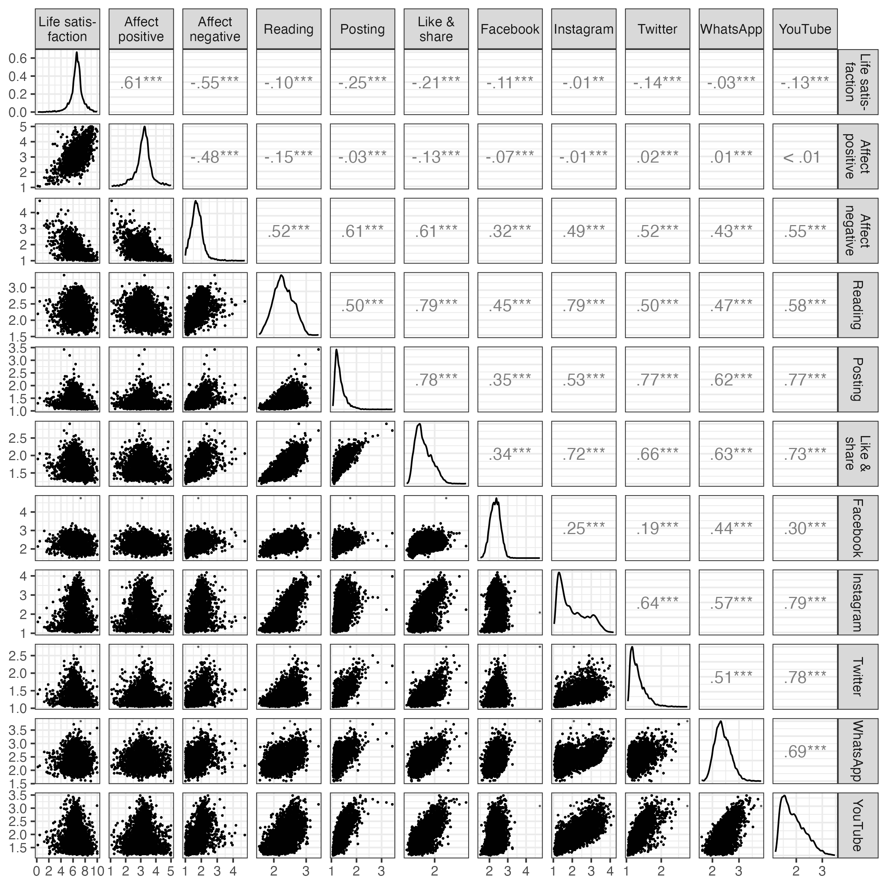

```{r set-up, include=F, cache=F}
set.seed(170819) # Seed for random number generation

knitr::opts_chunk$set(
  cache.extra = knitr::rand_seed,
  cache = T, 
  echo = F, 
  error = F,
  cache.lazy = FALSE
  )

# install necessary packages
# devtools::install_github("https://github.com/tdienlin/td@v.0.0.2.5")
# devtools::install_github("https://github.com/crsh/papaja@devel")

# load packages
library(devtools)
library(english)
library(GGally)
library(ggplot2)
library(gridExtra)
library(kableExtra)
library(lavaan)
library(lme4)
library(lmerTest)
library(magrittr)
library(papaja)
library(tidyverse)
library(td)
```

```{r load-data, include=F, cache=T}
# load workspace created from analyses.rmd to use results
load("data/workspace_3.RData")
```

# Introduction

Amidst the COVID-19 pandemic, staying informed became paramount, prompting heavy reliance on social media for updates, with use being at an all time high [@statistaAverageDailyTime2021]. 
The phenomenon of "doomscrolling" emerged as individuals struggled to disengage from COVID-19-related news [@buchananBriefExposureSocial2021; @sharmaDarkEndTunnel2022], sparking concerns about its impact on mental health [@sandstromDoomscrollingCOVIDNews2021]. 
While initial research began exploring this question [e.g., @bendauAssociationsCOVID19Related2021; @edenMediaCopingCOVID192020; @sewallObjectivelyMeasuredDigital2021], the impact of COVID-19 related social media use on well-being remains largely unknown. 
This study aims to assess the effects of different social media usage patterns on individual well-being using a comprehensive longitudinal dataset spanning 34 waves, offering insights into within-person causal relationships.

<!-- During the COVID-19 pandemic it was critical to stay informed regarding the latest developments. -->
<!-- How dangerous is the virus?  -->
<!-- In what region is it spreading?  -->
<!-- How is it transmitted?  -->
<!-- What are the current safety regulations? -->
<!-- To obtain relevant information, many people heavily relied on social media, with use being at an all time high [@statistaAverageDailyTime2021]. -->
<!-- Some actually could not stop using social media to learn about COVID-19 related news, and a new phenomenon termed "doomscrolling" emerged [@sharmaDarkEndTunnel2022]. -->
<!-- Many users were glued to their screens and found it hard to pursue other relevant activities [@buchananBriefExposureSocial2021]. -->
<!-- In the media it was hence increasingly asked whether using social media for COVID-19 related reasons would, next to all other stressors, create an additional burden on mental health [@sandstromDoomscrollingCOVIDNews2021]. -->
<!-- Although research has begun addressing this question -->
<!-- [e.g., @bendauAssociationsCOVID19Related2021; @edenMediaCopingCOVID192020; @sewallObjectivelyMeasuredDigital2021], -->
<!-- it still largely unknown if COVID-19 related social media use during the pandemic has had a meaningful impact on well-being. -->
<!-- This study hence aims to 1) reveal the effect of the different types and channels of social media use on individual well-being, 2) provide generalizable and robust results by analyzing a large-scale longitudinal data-set with 34 waves, and 3) determine the within-person causal effects by analyzing how changes in social media use lead to changes in well-being. -->

## Understanding Well-being and Media Use

This study investigates how different _facets_ of subjective well-being are affected by different _types_ and different _channels_ of communication [@meierComputermediatedCommunicationSocial2020a].
Building on the typology of subjective well-being---defined as "referring to the various types of subjective evaluations of one’s life, including both cognitive evaluations and affective
feelings" [@dienerAdvancesOpenQuestions2018, p. 3]---three different well-being facets are analyzed: life satisfaction, positive affect, and negative affect.

Social media is a broad term, encompassing subdimensions such as social networking sites (e.g., Facebook or Instagram), instant messengers (e.g., WhatsApp or Signal), or interactive video-platforms (e.g., YouTube or TikTok) [@carrSocialMediaDefining2015].
Effects of social media depend on how they are used: while purposeful, active, social use is generally related to positive outcomes, passive, non-purposeful and asocial use is related to negative outcomes [@frisonExploringRelationshipsDifferent2015; @verduynSocialNetworkingSites2022].
However, note that these general distinctions have been challenged recently [@meierDoesPassiveSocial2022, @valkenburgAssociationsActivePassive2022].
In this study, I hence distinguish three types of use and five popular channels. 
The types of use include posting (active use), reading (passive use), and liking and sharing (low-threshold active use) COVID-19 related content.
<!-- In doing so, this study analyzes social media use focused on COVID-19 related content. -->
<!-- , which includes posting thoughts about the pandemic, reading posts and comments , or liking and sharing COVID-19 related content. -->
The five channels to be investigated are Facebook, Twitter, Instagram, WhatsApp, and YouTube, which at the time ranked among the most popular social media services in Austria. 

This study aims to provide a nuanced analysis of how a specific type of social media use influences various well-being outcomes. 
A general measure of time spent on social media would be insufficient to address how engagement with COVID-19-related content affects users. 
Conversely, using overly specific measures might be less broadly relevant or insightful. 
For example, demonstrating that receiving uplifting messages boosts social support or that encountering hate speech causes distress might yield limited insights. 
That said, ultimately, the specificity of a measure is not inherently right or wrong but reflects different approaches to answering different questions.

## Social Media Effects on Well-Being

<!-- How easily can well-being be affected by external influences? -->
<!-- In general, according to the set-point theory, well-being is considered to be surprisingly stable [@lykkenHappinessWhatStudies1999]. -->
<!-- Although specific events such as marriage or salary increase can have significant impacts on well-being, effects are often only short-term, with well-being after some time returning to prior levels [@dienerAdvancesOpenQuestions2018]. -->
<!-- Specific factors such as unemployment, disability, or death, however, can cause long-term changes in well-being [@lucasAdaptationSetpointModel2007]. -->
<!-- So although well-being can be affected by external events and factors, it seems this does not happen easily. -->

<!-- Can social media use be such a factor? -->
Current literature overviews suggest that more active social media users report on average lower well-being [@meierComputermediatedCommunicationSocial2020a].
However, for most well-being outcomes, such as life satisfaction, general well-being, or loneliness, the effects are small [@meierComputermediatedCommunicationSocial2020a]. 
In addition, these results are based mostly on correlational research, and a recent meta study based on experimental studies did not find significant causal effects [@fergusonSocialMediaExperiments2024].
These small or even non-existent findings can be explained with the differential susceptibility of media effects model [@valkenburgDifferentialSusceptibilityMedia2013], which states that there is substantial _variation_ of media effects for individual users.
<!-- Whereas for some users social media are more beneficial, for others they are more harmful. -->
<!-- On average, however, effects tend to be small [@valkenburgDifferentialSusceptibilityMedia2013]. -->
For example, in one study it was estimated that roughly one quarter of all users experienced negative effects, another quarter positive effects, while for the rest the effects were neutral [@beyensSocialMediaUse2021].
<!-- Whether or not effects are positive or negative depend on (a) dispositional factors (e.g., personality, temperament, gender), (b) developmental factors (e.g., age, developmental tasks), (c) and social factors (e.g., environment, norms, upbringing) [@valkenburgDifferentialSusceptibilityMedia2013]. -->
<!-- Effects depend also on the content that is consumed---if the content is aligned with dispositions, developmental capacities, and converging contexts, effects tend to be stronger [@valkenburgDifferentialSusceptibilityMedia2013]. -->

Why are the effects of social media use on well-being small on average, especially given that several scholars theorize strong negative effects [@haidtAnxiousGenerationHow2024, @twengeIGENWhyToday2017]?
Two prominent media effect theories argue implicitly against strong average negative effects.
First, according to mood management theory [@zillmannMoodManagementCommunication1988], using media can affect people's moods.
<!-- Use can be stimulating or overwhelming, relaxing or boring. -->
After some time, users implicitly learn which media help them balance their mood and affect according to their own situational needs [@zillmannMoodManagementCommunication1988].
Those media that eventually become part of one's media repertoire hence, on average, tend to be beneficial for users to regulate their mood [@marcianoDynamicsAdolescentsSmartphone2022]. 
In conclusion, if a certain medium is used frequently, mood-management theory argues that it is likely not detrimental for well-being.

Second, while mood management theory considers media use mainly driven by implicit learning experiences, uses and gratifications theory upholds that the process is more explicit and rational [@katzUsesGratificationsResearch1973].
Users select those media that they expect to have a desired effect, for example on mood, knowledge, or entertainment.
<!-- If those beneficial media effects are missing, people will spend their time elsewhere. -->
And social media, in general, offer several beneficial effects, explaining their ubiquitous use.
They help find relevant information, maintain and foster relationships, express one's personality, and entertain oneself [@pelletierOneSizeDoesn2020].

Third, and closely related, media use affords both both positive and negative mechanisms, which differently impact well-being outcomes.
These include factors like social comparison, inspiration, social connectedness, social support, displacement of in-person activities, information management, information overload, misinformation, reputation building, romantic connection, coping resources, or emotional contagion [@clarkSocialNetworkSites2018; @hallSocialMediaUse2022; @pelletierOneSizeDoesn2020; @vandenabeeleDigitalWellbeingDynamic2021; @verduynSocialNetworkingSites2022].
Given these differential mechanisms, strong one-sided effects appear less likely than nuanced and moderate effects. 

<!-- In conclusion, because people spend so much time on social media consuming COVID-19 related content, according to mood management theory, uses and gratifications theory, and multiple differential mechanisms, average effects on well-being are likely not particularly negative. -->

## Social Media During COVID-19

If we look at COVID-19 related use more specifically, how could the various types and channels of COVID-19 related social media use affect well-being?
Several uses and gratifications exist, which help explain why people used social media frequently during the pandemic.
Despite incorrect information, social media provide a vast platform for disseminating _accurate and timely information_ about COVID-19 [@johnhopkinsuniversityCOVID19Map2023]. 
<!-- Access to reliable information can help people make informed decisions, alleviate uncertainties, and feel empowered during the pandemic. -->
Social media platforms enable individuals to _connect with others_ who are experiencing similar challenges during the pandemic [@guazziniSecondWaveAnalysis2022]. 
<!-- Engaging in online communities and support groups can provide emotional support and create a network of like-minded individuals. -->
Many mental health organizations and professionals utilize social media to share tips, strategies, and resources for _maintaining mental well-being_ during the pandemic. 
<!-- Engaging with such content might help individuals prioritize their mental health and develop resilience during challenging times. -->
Social media campaigns and initiatives can promote _positive COVID-19 behaviors_, such as mask-wearing, physical distancing, hand hygiene, and vaccination [@huntSocialMediaBased2022], which ultimately benefit well-being.
<!-- Public health organizations and influencers leverage the power of social media to spread awareness and encourage responsible actions, contributing to public health efforts and fostering a sense of collective responsibility. -->

On the other hand, the effects might be negative, perhaps best explained by the following five mechanisms.
Social media platforms can easily spread _false or misleading information_ about COVID-19 [@liYouTubeSourceInformation2020]. 
<!-- Due to the ease of sharing and the lack of fact-checking, inaccurate information can go viral and might cause confusion, anxiety, and panic among users. -->
Constant exposure to COVID-19-related content on social media can lead to _information overload_ and contribute to heightened anxiety levels [@fanInformationOverloadWellbeing2021]. 
<!-- The rapid spread of news, updates, and opinions can be overwhelming and might exacerbate existing stress or fears about the pandemic [@sharmaDarkEndTunnel2022]. -->
Discussions around COVID-19 are known for fostering negativity, with users sometimes engaging in _cyberbullying and harassment_. 
<!-- Discussions around COVID-19 can become heated and polarized, leading to personal attacks and online conflicts.  -->
<!-- Such experiences threaten mental well-being and might contribute to feelings of distress and isolation. -->
Social media often showcase the highlights and accomplishments of others, encouraging _social comparison_ [@przybylskiMotivationalEmotionalBehavioral2013]. 
Especially during a pandemic, seeing how others successfully cope with every-day challenges---for example, by baking banana bread, inventing creative games with kids, or exercising at home---might intensify feelings of inadequacy or FOMO, especially when individuals are unable to participate in similar activities due to restrictions or personal circumstances [@sharmaDarkEndTunnel2022].

<!-- There is still limited empirical research on how well-being is affected by social media use that is focused on COVID-19 specifically. -->
Echoing the theoretical rationales outlines above, empirical studies have yielded mixed results.
Some studies found negative effects, indicating that excessive social media use for COVID-19 content led to compulsive behavior and increased stress levels, particularly due to upward social comparison [@stainbackCOVID1924News2020]. 
Individuals who relied on social media as their primary information source reported higher levels of anxiety and depression symptoms [@bendauAssociationsCOVID19Related2021]. 
Doom-scrolling was associated with negative emotional experiences [@buchananBriefExposureSocial2021].
On the other hand, some studies reported positive outcomes. 
Certain individuals experienced increased virtual community and social connectedness during the pandemic through social media, which contributed to their well-being [@guazziniSecondWaveAnalysis2022]. 
Additionally, identification with social media networks was associated with reduced feelings of loneliness [@latikkaLonelinessPsychologicalDistress2022].
Several studies reported mostly neutral or dual effects of social media use on well-being indicators [@edenMediaCopingCOVID192020; @sewallObjectivelyMeasuredDigital2021].
<!-- Overall, the literature demonstrates a mixed picture, highlighting both positive and negative effects of social media use focused on or during COVID-19 on well-being. -->

<!-- It is important to consider individual differences, usage patterns, and other factors that may influence the impact of social media on well-being during this challenging period. -->

In conclusion, given these mixed empirical results, together with the observation that social media effects on well-being are very small in general, and that several plausible theoretical mechanisms exist for both positive and negative effects, I expect that COVID-19 related communication on social media should not be decidedly positive or negative.
<!-- It seems most likely that both positive and negative coexist, but that on average using social media for COVID-19 related reasons should not have substantial effects on well-being. -->

> Hypothesis: The within-person effects of all measures of COVID-19 related social media use (types: reading, liking and sharing, posting; channels: Twitter, Instagram, Facebook, YouTube, WhatsApp) on all measures of well-being indicators (positive affect, negative affect, life satisfaction)---while controlling for several stable and varying covariates such as sociodemographic variables and psychological dispositions (see below)---will be trivial.

## Smallest Effect Size of Interest

Exploring the hypothesis entails establishing the criteria for discerning a 'trivial effect size.' 
To achieve this, it is necessary to define the smallest effect size of interest (SESOI) [@anvariUsingAnchorbasedMethods2021].
<!-- , which helps determine an effect's practical significance.  -->
In this context, a trivial effect should fall below the threshold set by the SESOI (detailed below).
Determining what constitutes a minimally intriguing, nontrivial effect is a matter with normative implications, making it challenging to arrive at a definitive, singular consensus. 
<!-- Nonetheless, it remains both essential and beneficial to strive for a reasonable benchmark.  -->
I propose the following SESOI as a suitable reference point for this study:

> SESOI: If a heavy user of COVID-19 related social media content suddenly _stops_ using social media altogether, this should have a _noticeable_ impact on their overall well-being.

<!-- What does this mean practically and how can it be operationalized? -->
Put concretely, in this study COVID-19 related social media use was measured on a 5-point scale, ranging from 1 = _never_ to 5 = _several times a day_. Thus, a change of four units in social media use (e.g., a complete stop) should correspond to a noticeable change in well-being.
According to @normanInterpretationChangesHealthrelated2003, people can reliably notice seven levels of change in satisfaction with health.
So if satisfaction is measured on a 7-point scale, a four unit change in social media use should result in a one unit change in life satisfaction. 
Life satisfaction was measured on an 11-point scale, and affect on a 5-point scale. 
Transposed to this scaling, the SESOI for life satisfaction is _b_ =  ±.30, and for positive and negative affect _b_ = ±.15 (see online supplementary material).

# Method
## Sample

The data come from the Austrian Corona Panel Project [@kittelAustrianCoronaPanel2020], which is a large-scale standalone panel study, consisting of 34 waves.
<!-- The data are hosted on AUSSDA, are publicly available here (https://doi.org/10.11587/28KQNS). -->
<!-- Participants were sampled from a pre-existing online access panel provided by the company Marketagent, Austria. -->
<!-- Panel members were incentivized with 180 credit points for each wave of the study. -->
The study was conducted between March 2020 and February 2023.
Between March 2020 and July 2020, the intervals between waves were weekly, until May 2022 (wave 32) monthly, and afterward after 5 months.
Each wave consists of at least 1,500 respondents.
Panel mortality (on average ca. 5 percent per wave) was compensated through a continuous re-acquisition of new participants (on average ca. 80 new respondents per wave). 
The sample size was _N_ = `r d_raw %>% nrow() %>% prettyNum(big.mark = ",")`, with overall `r d_long %>% nrow() %>% prettyNum(big.mark = ",")` observations.

<!-- For an overview of the study set-up, see Figure \@ref(fig:study-desc). -->

<!-- ```{r study-desc, warning=F, message=F, fig.cap="Overview of study set-up", out.width = "1\\textwidth", warning=F, message=F, prompt=F} -->
<!-- knitr::include_graphics("figures/fig_study_description.png") -->
<!-- ``` -->

Achieved via quota sampling, the sample matched the Austrian population in terms of age, gender, region/state, municipality size, and educational level.
In order to participate in the study, the respondents needed to be Austrian residents and had to be at least 14 years of age. 
All respondents needed to have access to the internet (via computer or mobile devices such as smartphones or tablets). 
The average age was `r mean(2021 - d_wide$year_birth, na.rm = T) %>% round(0)` years, `r mean(d_wide$male, na.rm = T) %>% round(., 2) * 100` percent were male, `r (d_wide %>% filter(.$edu_fac %in% c("State college", "Bachelor", "Master", "PhD"))) %>% nrow() %>% divide_by(sum(table(d_wide$edu_fac))) %>% multiply_by(100) %>% round(0)` percent had a University degree, and `r (table(d_wide$employment_fac)["Unemployed"] / sum(table(d_wide$employment_fac))) %>% unname() %>% multiply_by(100) %>% round(., digits = 0)` percent were currently unemployed.

## Data Analysis

The hypothesis is analyzed using the interval testing approach as proposed by @dienesUsingBayesGet2014.
To illustrate, let us consider the case of life satisfaction [SESOI: ±.30]. 
Here, the null-region lies between -.30 and +.30.
<!-- If the 95% confidence interval falls completely within the null-region (e.g., _b_ = -.05, [95% CI: -.15, .05]), the hypothesis that the effect is trivial is supported. -->
If the confidence interval falls completely outside of the null-region (e.g., _b_ = -.40, [95% CI: -.45, -.35]), the hypothesis is rejected and the existence of a meaningful negative effect is supported.
<!-- If the confidence interval and the null region overlap (e.g., _b_ = -.30, [95% CI: -.35, -.25]), the hypothesis is not supported and the results are considered inconclusive, while a meaningful positive effect is rejected. -->
<!-- If the confidence interval exceeds both sides of the null region (e.g., _b_ = -.025, [95% CI: -.40, .35]), the hypothesis is not supported and judgement is suspended. -->
For an illustration, see Figure \@ref(fig:sesoi).

```{r sesoi, warning=F, message=F, fig.cap="Using confidence intervals to test a null region. In this study, a trivial effect of social media use on life satisfaction is defined as ranging from b = -.30 to b = .30. Figure adapted from Dienes (2014).", fig.width=6, fig.height=2, warning=F, message=F, prompt=F}
# make table with data
d_plot <- tribble(
  ~name, ~type, ~Effect, ~ll, ~ul,
  "1. Accept trivial effect", "Decision Rule", -.02, -.12, .08, 
  "2. Reject trivial effect", "Decision Rule", -.40, -.45, -.35,
  "3. Reject positive effect", "Decision Rule", -.25, -.15, -.35,
  "4. Suspend judgement", "Decision Rule", -.025, -.40, .35,
) %>% 
  mutate(
    name = factor(name, levels = name),
    name = fct_rev(name)
         )

# design plot
plot <- ggplot(d_plot, aes(y = name, x = Effect)) +
  geom_vline(xintercept = 0, color = "darkgrey") + 
  geom_vline(xintercept = -.3, color = "darkgrey", linetype = "dashed") +
  geom_vline(xintercept = .3, color = "darkgrey", linetype = "dashed") +
  geom_point(aes(Effect)) +
  geom_errorbarh(aes(xmin = ll, xmax = ul), height = .5) +
  theme(axis.title.y = element_blank()) +
  labs(x = "Effect Size (b)",
       caption = "Smallest effect size of interest: b = |.30|
                  Null region: b = -.30, .30")

# ggsave("figures/figure_intervals.png", height = 3.5)
plot
```

### Causality

<!-- When analyzing causality through longitudinal designs, it is important to address several critical aspects.  -->
Analyzing causal effects within non-experimental designs requires adopting an internal perspective, focusing on _within-person effects_ [@hamakerWhyResearchersShould2014]. 
This entails evaluating how alterations in an individual's media consumption directly impact changes in their own well-being. 
<!-- Comparisons between individuals, as observed in longitudinal data, lack the granularity needed to understand these causal dynamics [@hamakerWhyResearchersShould2014].  -->
Consequently, this study exclusively investigates within-person effects.
<!-- to shed light on this intricate relationship. -->

An essential strategy for isolating the genuine impact of variables is to _control for confounding factors_ that influence both media use and well-being [@rohrerThinkingClearlyCorrelations2018]. 
In the context of within-person analysis, this necessitates accounting for time-varying confounders [@rohrerTheseAreNot2023]. 
However, a cautious balance must be maintained by not controlling for variables that mediate the relationship [@rohrerThinkingClearlyCorrelations2018], as their inclusion could distort the assessment of the causal effect. 
This study therefore incorporated several control variables (see below), which have demonstrated connections with both social media use and well-being and are likely not mediators [@egerStatisticalMetaanalysisWellbeing2015]. 
<!-- These encompass gender, age, education, place of birth and parental place of birth in Austria, Vienna residency, consumption of text-based and video-based news, household characteristics, health status, living space features, employment-related factors, income, outdoor activities, risk propensity, and locus of control.  -->

Establishing causality necessitates determining a _plausible temporal interval_ [@rohrerTheseAreNot2023]. 
For instance, fluctuations in positive and negative affect call for shorter intervals, while the more enduring nature of life satisfaction implies longer intervals [@dienlinImpactDigitalTechnology2020]. 
In this study, I examine the linkage between changes in social media use and changes in affect within the same week. 
Specifically, I investigate if heightened COVID-19-related social media use during a week corresponds with enhanced or diminished affect during that same week. 
I consider a longer interval for life satisfaction, examining whether increased COVID-19-related social media use over the course of a week influences one's life satisfaction at the week's end. 
<!-- This approach aims to uncover whether changes in social media consumption prompt simultaneous changes in affect and subsequent changes in life satisfaction. -->
<!-- Furthermore, the study's main analyses implement this temporal interval through item wording rather than relying on lagged measures from previous waves.  -->
Supplementary analyses extend this investigation to observe how media use might affect well-being one or four months later. 
<!-- In all instances, confounding variables are methodically controlled for, enhancing the study's capacity for causal interpretation. -->

### Statistical model

The hypothesis was analyzed using random effect within-between models [REWB, @bellFixedRandomEffects2019]. 
Altogether three models were run, one for each dependent variable.
The data were hierarchical, and responses were separately nested in participants and waves (i.e., participants and waves were implemented as random effects).
Nesting in participants accounts for the within-person design. 
Nesting in waves controls for general exogenous developments, such as general decreases in well-being in the population, for example due to lockdown measures.
<!-- To illustrate, if general levels of well-being were reduced at one wave, for example due to lockdowns, this was accounted for in the model. -->
Thus, there was no need additionally to control for specific phases or measures of the lockdown.
Predictors were modeled as fixed effects.
They included social media communication types and channels, separated into within and between-person factors, as well as stable and varying covariates.
<!-- Between-person predictors are the predictors centered on the grand mean; within-person predictors are the predictors centered on the person's mean. -->
Between-person predictors (which, measuring relations, are not of particular interest in this study, but are reported online) represent how the mean of one respondent differs from the mean of all the other respondents.
The within-person predictors represent how much a person at one specific wave differs from their own mean.
<!-- For example, we could find that on Wave 3 a person used social media more than usual, while also experiencing more negative affect than usual. -->
All predictors were included simultaneously in each of the three models. 
No collinearity of predictors was observed.

The factorial validity of the scales were tested with confirmatory factor analyses (CFA).
Because Mardia’s test showed that the assumption of multivariate normality was violated, I used the more robust Satorra-Bentler scaled and mean-adjusted test statistic (MLM) as estimator.
Mean scores were used for positive and negative affect.
Although imputation has inherent drawbacks, we followed recent recommendations to impute missing data on larger scales [@endersAppliedMissingData2022].
Missing responses were imputed using multiple imputation with predictive mean matching (five iterations, 30 data-sets), including categorical variables.
All variables were imputed except the social media use measures, as they were not collected on each wave.
All variables included in the analyses presented here were used to impute missing data.
For the main analyses, results were pooled across all thirty data-sets.

To contextualize the results, I conducted additional exploratory analyses (see online materials)
I reran the analyses (a) with additional not-preregistered covariates such as trust in media or government, (b) without covariates, (c) with single imputation, and (d) without imputation.
<!-- For more information on the analyses, a complete documentation of the models and results, and all additional analyses, see [companion website](https://XMtRA.github.io/Austrian_Corona_Panel_Project). -->

## Measures

<!-- For the variables' means, range, and variance, see Table \@ref(tab:tab-descriptives). -->
<!-- For a complete list of all items and item characteristics, see [companion website](https://XMtRA.github.io/Austrian_Corona_Panel_Project). -->

### Well-being

Life satisfaction was measured with the item "All things considered, how satisfied are you with your life as a whole nowadays?", which comes from the European Social Survey.
The response options ranged from 0 (_extremely dissatisfied_) to 10 (_extremely satisfied_).

To capture positive affect, respondents were asked how often in the last week they felt (a) calm and relaxed, (b) happy, and (c) full of energy [@worldhealthorganizationWellbeingMeasuresPrimary1998].
The response options were 1 (_never_), 2 (_on some days_), 3 (_several times per week_), 4 (_almost every day_), and 5 (_daily_).
The scale showed good factorial fit, `r fit_txt(cfa_aff_pos)`.
Reliability was high, $\omega$ = `r rel_aff_pos %>% my_round("std")`.

For negative affect, respondents were asked how often in the last week they felt (a) lonely, (b) aggravated, (c) so depressed, that nothing could lift you up, (d) very nervous, (e) anxious, and (h) glum and sad [@worldhealthorganizationWellbeingMeasuresPrimary1998].
The response options were 1 (_never_), 2 (_on some days_), 3 (_several times per week_), 4 (_almost every day_), and 5 (_daily_).
The scale showed good factorial fit, `r fit_txt(cfa_aff_neg)`.
Reliability was high, $\omega$ = `r rel_aff_neg %>% my_round("std")`.

All three variables were measured on each wave.

### COVID-19 related social media use

COVID-19 related social media use focused on communication types was measured with the three dimensions of (a) reading, (b) liking and sharing, and (c) posting.
The items come from @wagnerAUTNESOnlinePanel2018 and were adapted for the context of this study.
The general introductory question was "How often during the last week have you engaged in the following activities on social media?".
The three items were "Reading the posts of others with content on the Coronavirus", "When seeing posts on the Coronavirus, I clicked 'like', 'share' or 'retweet'", "I myself wrote posts on the Coronavirus on social media."
Answer options were 1 (_several times per day_), 2 (_daily_), 3 (_several times per week_), 4 (_weekly_), 5 (_never_).
The items were inverted for the analyses.

COVID-19 related social media use focused on channels was measured with five variables from @wagnerAUTNESOnlinePanel2018, adapted for this study. 
The general introductory question was "How often in the last week have you followed information related to the Corona-crisis on the following social media?"
The five items were (a) Facebook, (b) Twitter, (c) Instagram, (d) Youtube, and (e) WhatsApp.
Again, the answer options were 1 (_several times per day_), 2 (_daily_), 3 (_several times per week_), 4 (_weekly_), 5 (_never_).
Again, the items were inverted for the analyses.

Social media use was measured for all participants on waves 1, 2, 8, 17, 23, and 28 (see Figure 1).
Freshly recruited respondents always answered all questions on COVID 19-related social media use.
Because new respondents always provided data on media use, it was possible to include these data into the analyses. 
Hence, for the main analyses data from all 34 waves were used.
<!-- In the additional analyses I tested longer intervals, namely if changes in social media use were associated with changes in well-being either one month of four months later. -->
<!-- For these analyzes I used the predictors from waves 1, 2, 8, 17, 23, and 28, to see if they predicted changes in well-being either one month or four months later.  -->

### Control variables

The effects of COVID-19 related social media use were controlled for the following stable variables: 
gender (female, male, diverse), age, education (ten options), Austria country of birth (yes/no), Austria parents' country of birth (no parent, one parent, both parents), and household size.
I also controlled for the following varying covariates: five items on current living conditions, including self-reported physical health, whether participants contracted COVID-19 since the last wave, current household income, working in home-office, and overall work hours; nine items measuring use of specific national text-based and video-based news outlets; five items measuring outdoor activities such as exercise or meeting friends; and two more psychological measures including locus of control and disposition to take risks. 

# Results
## Descriptive Analyses

Looking at the variables from a descriptive perspective, aligned with set-point theory we can see that the level of all well-being measures were comparatively stable during data collection (see Figure \@ref(fig:fig-descriptives)).
COVID-19 related social media use, however, showed changes. 
Reading, sharing and liking COVID-19 related content decreased substantially (almost one scale point from 3 to 2). 
Posting about COVID-19 related content stayed the same.
Using Facebook and WhatsApp for COVID-19 related content decreased. 
Instagram, YouTube, and Twitter stayed the same.
The general initial decrease could be explained by the fact that the collection of data began at the end of March 2020, hence approximately three months after the pandemic's onset.
After an initial uptick, COVID-19 related social media use might have already been declining at the time.

```{r fig-descriptives, fig.cap="Well-being and media use across the 34 waves. Note. Values obtained from mixed effect models, with participants and waves as grouping factors and without additional predictors.", out.width = "\\textwidth", cache=F, warning=F, message=F, prompt=F}
# fig_desc
knitr::include_graphics("figures/fig_descriptives.png")
```

Using the average values across all waves, which provides a stable picture of the general relations, I next looked at the correlations between social media use and well-being (see Figure \@ref(fig:fig-correlations)). 
<!-- Several interesting patterns emerged. -->
In general, people who spend more time engaging with COVID-19 related content on social media reported reduced well-being.
Users who spend more time reading, liking and sharing, and posting COVID-19 related content were less satisfied with their lives.
They also showed slightly less positive affect.
This overall negative picture was even more pronounced for negative affect.
People who engaged more with COVID-19 related content, including all types and channels of communication, reported substantially higher levels of negative affect.
For example, people who were more likely to post COVID-19 content had much higher levels of negative affect (_r_ = `r tab_cor[tab_cor$term == "Posting", "Affect.negative"]`).
Note that these results represent between-person correlations, not causal within-person effects.

```{r fig-correlations, fig.cap="Descriptives of the main variables, capturing well-being and social media use with their average values across all waves. Upper triangle: correlation coefficients; diagonal: density plots; lower triangle: scatter plots.", out.width = "\\textwidth", cache=F, warning=F, message=F, prompt=F}

```

## Preregistered Analyses

<!-- The study's main hypothesis was that the causal effects of all types and channels of social media use on all facets of well-being would be trivial. -->
Regarding the effects of different _communication types_ (i.e., reading, sharing, of posting about COVID-19 related content), all within-person effects fell completely within the a-priori defined null region (see Figure \@ref(fig:fig-within)).
For example, respondents who used social media more frequently than usual to like or share COVID-19 related content did not show a simultaneous change in life satisfaction (_b_ = `r data_tab_within %>% filter(dv == "Life satisfaction" & iv == "Liking & Sharing" & Variance == "within" & Analysis == "Publication") %>% select(estimate) %>% round(2)` [95% CI `r data_tab_within %>% filter(dv == "Life satisfaction" & iv == "Liking & Sharing" & Variance == "within" & Analysis == "Publication") %>% select(conf.low) %>% round(2)`, `r data_tab_within %>% filter(dv == "Life satisfaction" & iv == "Liking & Sharing" & Variance == "within" & Analysis == "Publication") %>% select(conf.high) %>% round(2)`]).
As a result, the hypothesis of trivial effects was supported for all COVID-19 related types of social media communication.

However, several effects stood out, as statistically they were significantly different from zero.
Users who read more COVID-19 related content than usual reported slightly reduced levels of positive affect (_b_ = `r data_tab_within %>% filter(dv == "Positive affect" & iv == "Reading" & Variance == "within" & Analysis == "Publication") %>% select(estimate) %>% round(2)` [95% CI `r data_tab_within %>% filter(dv == "Positive affect" & iv == "Reading" & Variance == "within" & Analysis == "Publication") %>% select(conf.low) %>% round(2)`, `r data_tab_within %>% filter(dv == "Positive affect" & iv == "Reading" & Variance == "within" & Analysis == "Publication") %>% select(conf.high) %>% round(2)`]).
Users who liked and shared more COVID-19 related content than usual also experienced slightly more negative affect than usual (_b_ = `r data_tab_within %>% filter(dv == "Negative affect" & iv == "Posting" & Variance == "within" & Analysis == "Publication") %>% select(estimate) %>% round(2)` [95% CI `r data_tab_within %>% filter(dv == "Negative affect" & iv == "Posting" & Variance == "within" & Analysis == "Publication") %>% select(conf.low) %>% round(2)`, `r data_tab_within %>% filter(dv == "Negative affect" & iv == "Posting" & Variance == "within" & Analysis == "Publication") %>% select(conf.high) %>% round(2)`]).
Posting COVID-19 related content affected all types of well-being. 
Users who wrote more COVID-19 related posts than usual also reported slightly less life satisfaction than usual (_b_ = `r data_tab_within %>% filter(dv == "Life satisfaction" & iv == "Posting" & Variance == "within" & Analysis == "Publication") %>% select(estimate) %>% round(2)` [95% CI `r data_tab_within %>% filter(dv == "Life satisfaction" & iv == "Posting" & Variance == "within" & Analysis == "Publication") %>% select(conf.low) %>% round(2)`, `r data_tab_within %>% filter(dv == "Life satisfaction" & iv == "Posting" & Variance == "within" & Analysis == "Publication") %>% select(conf.high) %>% round(2)`]) and slightly more negative affect than usual (_b_ = `r data_tab_within %>% filter(dv == "Negative affect" & iv == "Posting" & Variance == "within" & Analysis == "Publication") %>% select(estimate) %>% round(2)` [95% CI `r data_tab_within %>% filter(dv == "Negative affect" & iv == "Posting" & Variance == "within" & Analysis == "Publication") %>% select(conf.low) %>% round(2)`, `r data_tab_within %>% filter(dv == "Negative affect" & iv == "Posting" & Variance == "within" & Analysis == "Publication") %>% select(conf.high) %>% round(2)`]).
Interestingly, however, users who wrote more COVID-19 related posts than usual also experienced slightly _higher_ levels of positive affect than usual (_b_ = `r data_tab_within %>% filter(dv == "Positive affect" & iv == "Posting" & Variance == "within" & Analysis == "Publication") %>% select(estimate) %>% round(2)` [95% CI `r data_tab_within %>% filter(dv == "Positive affect" & iv == "Posting" & Variance == "within" & Analysis == "Publication") %>% select(conf.low) %>% round(2)`, `r data_tab_within %>% filter(dv == "Positive affect" & iv == "Posting" & Variance == "within" & Analysis == "Publication") %>% select(conf.high) %>% round(2)`]).

Regarding the COVID-19 related use of _social media channels_ (i.e., Facebook, Instagram, WhatsApp, YouTube, and Twitter) the results were comparable (see Figure \@ref(fig:fig-within)).
Changes in the frequency of using different social media channels to attain information regarding COVID-19 were unrelated to meaningful changes in well-being.
For example, respondents who used Facebook more frequently than usual to learn about COVID-19 did not show a simultaneous change in life satisfaction (_b_ `r data_tab_within %>% filter(dv == "Life satisfaction" & iv == "Facebook" & Variance == "within" & Analysis == "Publication") %>% select(estimate) %>% my_round("b")` [95% CI `r data_tab_within %>% filter(dv == "Life satisfaction" & iv == "Facebook" & Variance == "within" & Analysis == "Publication") %>% select(conf.low) %>% round(2)`, `r data_tab_within %>% filter(dv == "Life satisfaction" & iv == "Facebook" & Variance == "within" & Analysis == "Publication") %>% select(conf.high) %>% round(2)`]).
In sum, the hypothesis of trivial effects was supported also for the COVID-19 related use of important social media channels.

That said, two effects differed statistically from zero.
Respondents who used Twitter more frequently than usual to attain COVID-19 related content reported slightly higher levels of negative affect than usual (_b_ = `r data_tab_within %>% filter(dv == "Negative affect" & iv == "Twitter" & Variance == "within" & Analysis == "Publication") %>% select(estimate) %>% round(2)` [95% CI `r data_tab_within %>% filter(dv == "Negative affect" & iv == "Twitter" & Variance == "within" & Analysis == "Publication") %>% select(conf.low) %>% my_round("b")`, `r data_tab_within %>% filter(dv == "Negative affect" & iv == "Twitter" & Variance == "within" & Analysis == "Publication") %>% select(conf.high) %>% my_round("b")`]).
Likewise, respondents who used YouTube more frequently than usual for COVID-19 related issues reported slightly higher levels of negative affect than usual (_b_ = `r data_tab_within %>% filter(dv == "Negative affect" & iv == "YouTube" & Variance == "within" & Analysis == "Publication") %>% select(estimate) %>% round(2)` [95% CI `r data_tab_within %>% filter(dv == "Negative affect" & iv == "YouTube" & Variance == "within" & Analysis == "Publication") %>% select(conf.low) %>% my_round("b")`, `r data_tab_within %>% filter(dv == "Negative affect" & iv == "YouTube" & Variance == "within" & Analysis == "Publication") %>% select(conf.high) %>% my_round("b")`]).
However, both effects were still completely inside of the null region, hence likely not large enough to be considered meaningful.

For an overview of all within-person effects, see Figure \@ref(fig:fig-within).

```{r fig-within, fig.cap="Unstandardized within-person effects of COVID-19 related social media use on well-being. Note. The SESOI was b = |0.30| for life satisfaction and b = |0.15| for affect. Hence, all of the reported effects are not considered large enough to be meaningful.", cache=F, warning=F, message=F, fig.width=6, fig.height=4, out.width="\\textwidth"}
# fig_results_within
knitr::include_graphics("figures/fig_results_within.png")
```

## Exploratory Analyses

To contextualize the results reported above and to see if the study included any meaningful effects at all, I also looked at the effect sizes of the covariates.
<!-- Because each variable featured different response options, which would require defining a SESOI for each variable, I hence report the results of the standardized scales, which allows for a better comparison across the differently scaled variables. -->
I report the results of the standardized scales, which allows for a better comparison across the differently scaled variables.
As a SESOI, we can build on Cohen's convention that small effects begin at _r_ = |.10|.

The results showed that several effects crossed or fell completely outside of the SESOI, and can hence be considered meaningful.
For example, if physical health decreased, this had a meaningful detrimental impact on life satisfaction ($\beta$ `r data_tab_comp_std %>% filter(dv == "Life satisfaction" & iv == "Health") %>% select(estimate) %>% my_round("std_txt")` [95% CI `r data_tab_comp_std %>% filter(dv == "Life satisfaction" & iv == "Health") %>% select(conf.low) %>% my_round("std")`, `r data_tab_comp_std %>% filter(dv == "Life satisfaction" & iv == "Health") %>% select(conf.high) %>% my_round("std")`]), positive affect ($\beta$ `r data_tab_comp_std %>% filter(dv == "Positive affect" & iv == "Health") %>% select(estimate) %>% my_round("std_txt")` [95% CI `r data_tab_comp_std %>% filter(dv == "Positive affect" & iv == "Health") %>% select(conf.low) %>% my_round("std")`, `r data_tab_comp_std %>% filter(dv == "Positive affect" & iv == "Health") %>% select(conf.high) %>% my_round("std")`]), and negative affect ($\beta$ `r data_tab_comp_std %>% filter(dv == "Negative affect" & iv == "Health") %>% select(estimate) %>% my_round("std_txt")` [95% CI `r data_tab_comp_std %>% filter(dv == "Negative affect" & iv == "Health") %>% select(conf.low) %>% my_round("std")`, `r data_tab_comp_std %>% filter(dv == "Negative affect" & iv == "Health") %>% select(conf.high) %>% my_round("std")`]). 
Spending more time outside to exercise meaningfully increased positive affect ($\beta$ `r data_tab_comp_std %>% filter(dv == "Positive affect" & iv == "Sports") %>% select(estimate) %>% my_round("std_txt")` [95% CI `r data_tab_comp_std %>% filter(dv == "Positive affect" & iv == "Sports") %>% select(conf.low) %>% my_round("std")`, `r data_tab_comp_std %>% filter(dv == "Positive affect" & iv == "Sports") %>% select(conf.high) %>% my_round("std")`]).
The strongest aspect affecting well-being was internal locus of control.
If people felt more in control of their lives, this strongly increased both life satisfaction ($\beta$ `r data_tab_comp_std %>% filter(dv == "Life satisfaction" & iv == "Internal locus of control") %>% select(estimate) %>% my_round("std_txt")` [95% CI `r data_tab_comp_std %>% filter(dv == "Life satisfaction" & iv == "Internal locus of control") %>% select(conf.low) %>% my_round("std")`, `r data_tab_comp_std %>% filter(dv == "Life satisfaction" & iv == "Internal locus of control") %>% select(conf.high) %>% my_round("std")`]) and 
positive affect ($\beta$ `r data_tab_comp_std %>% filter(dv == "Positive affect" & iv == "Internal locus of control") %>% select(estimate) %>% my_round("std_txt")` [95% CI `r data_tab_comp_std %>% filter(dv == "Positive affect" & iv == "Internal locus of control") %>% select(conf.low) %>% my_round("std")`, `r data_tab_comp_std %>% filter(dv == "Positive affect" & iv == "Internal locus of control") %>% select(conf.high) %>% my_round("std")`]), 
while decreasing negative affect ($\beta$ `r data_tab_comp_std %>% filter(dv == "Negative affect" & iv == "Internal locus of control") %>% select(estimate) %>% my_round("std_txt")` [95% CI `r data_tab_comp_std %>% filter(dv == "Negative affect" & iv == "Internal locus of control") %>% select(conf.low) %>% my_round("std")`, `r data_tab_comp_std %>% filter(dv == "Negative affect" & iv == "Internal locus of control") %>% select(conf.high) %>% my_round("std")`]).
For an overview, see Figure \@ref(fig:fig-control).

```{r fig-control, fig.cap = "Results of main variables together with covariates to provide context. All variables standardized. SESOI: beta = |.10|", cache=F, warning=F, message=F, fig.width=7, fig.height=8, out.width="\\textwidth"}
# fig_results_comp_std
knitr::include_graphics("figures/fig_results_comp_std.png")
```

Because life satisfaction is more stable than affect, the effects of communication might materialize some time later. 
I hence also tested the effects across the longer intervals of one month and four months.
Results showed that all effects disappeared. 
No effect remained significant, implying that at least in this case in this case effects take place on a shorter interval.

Finally, as suggested by the differential susceptibility of media effects model, media effects can depend on dispositional factors, developmental stages, or cultural norms [@valkenburgDifferentialSusceptibilityMedia2013], such as gender and age [@orbenWindowsDevelopmentalSensitivity2022].
I hence reran the analyses, differentiating effects for boys and girls and for age cohorts.
The results showed that effects did not differ across genders.
The effects also did not depend on age. 
However, one effect stood out and was significant.
Compared to the middle age category Generation X, results showed that if users from Generation Z posted more COVID-19 content than usual this lead to significantly more negative affect ($\beta$ `r fit_aff_neg_lmer_age_tab %>% filter(term == "age_genGen Z:soc_med_post_w") %>% select(estimate) %>% my_round("std_txt")` [95% CI `r fit_aff_neg_lmer_age_tab %>% filter(term == "age_genGen Z:soc_med_post_w") %>% select("2.5 %") %>% my_round("std")`, `r fit_aff_neg_lmer_age_tab %>% filter(term == "age_genGen Z:soc_med_post_w") %>% select("97.5 %") %>% my_round("std")`]).

# Discussion

This study, based on a representative panel study spanning 34 waves within the Austrian population, investigated the impact of COVID-19-related social media usage on well-being. 
The between-person correlations revealed that increased engagement with COVID-19 content on social media was associated with decreased well-being. 
For instance, individuals consuming more COVID-19-related content reported slightly lower life satisfaction, somewhat reduced positive affect, and notably elevated negative affect compared to others. 

To explore if these between-person correlations translated into within-person effects, it was examined whether within-person changes in media consumption corresponded with within-person changes in well-being. 
As expected and aligned with the literature, increased consumption of COVID-19 content did not significantly decrease well-being at a meaningful level. 
While several statistically significant effects emerged, their magnitudes were notably small. 
For instance, reading more COVID-19 posts than usual slightly decreased positive affect. 
Liking and sharing more COVID-19 content than usual were associated with slightly higher negative affect. 
Posting more COVID-19 content reduced life satisfaction slightly while elevating both positive and negative affect. 
The effects, although statistically significant, fell within a predefined range considered insignificant.

<!-- Further analysis demonstrated that factors such as health and physical activity, which would be expected to have substantial impacts on well-being, indeed showed significant influences.  -->
<!-- Additionally, extended assessments covering one and four months did not yield meaningful effects.  -->
<!-- In summary, the influence of COVID-19-related social media activity on well-being was not substantial.  -->
<!-- This counters popular concerns over social media use during crises causing substantial well-being risks. -->

That said, there is no consensus among scholars as to when effects become practically relevant and meaningful. 
If we adopt a more liberal and cautious perspective, the study indicates a tendency for COVID-19-related social media usage to impact well-being negatively more frequently than positively. 
Notably several statistically significant negative effects were observed, contrasting with a single positive effect. 
Hence, although effects were overall very small, the trend was for effects to be negative.

These results align with prior research highlighting that social media usage is rather associated with elevated negative affect but not reduced life satisfaction [@meierComputermediatedCommunicationSocial2020a]. 
<!-- The often extreme, negative, or aggressive tone of COVID-19 discussions on social media [@fanStigmatizationSocialMedia2020] could adversely impact more active authors.  -->
<!-- The negative effects may be explained by the consumption of negative and misleading information [@liYouTubeSourceInformation2020]. -->
The study suggests that varying communication types and channels warrant separate analyses. 
Reading COVID-19 related content slightly reduced positive affect, while liking, sharing, and posting increased negative affect slightly. 
Posting COVID-19-related comments increased both negative and positive affect slightly, while it reduced life satisfaction. 
<!-- This suggests that posting generates stronger reactions, both positive and negative.  -->
Posting COVID-19 content was more negative for Generation Z, potentially reflecting broader negative effects of social media on this generation. 
Together, this finding is aligned with recent work challenging the assumption that active use is inherently beneficial and passive use detrimental [@valkenburgAssociationsActivePassive2022].
Notably, communication channels exhibited differences. 
Twitter and YouTube appeared more negative, whereas Instagram, WhatsApp, and Facebook were neutral.

<!-- In conclusion, the study aligns with theoretical models and past research.  -->
<!-- It supports the notion of social media effects being small and contingent on communication type and channel [@meierComputermediatedCommunicationSocial2020a; @valkenburgDifferentialSusceptibilityMedia2013].  -->
<!-- Effects not being strongly negative also help explain why people spent so much time engaging with COVID-19 content on social media [@katzUsesGratificationsResearch1973; @zillmannMoodManagementCommunication1988]. -->

Several limitations exist. While the study's focus on within-person effects enhances causal understanding, challenges exist related to additional relevant confounding exogenous variables not included here [@rohrerThinkingClearlyCorrelations2018], correct definition of the SESOI [@anvariUsingAnchorbasedMethods2021], and exact measurement of media use [@scharkowAccuracySelfreportedInternet2016]. 
As noted above, different operationalizations of COVID-19 related social media use might lead to different results. 
For example, the measures of social media use did not include interpersonal communication about COVID-19 related content, which might result in more positive outcomes [@frisonExploringRelationshipsDifferent2015].
While this study did not find meaningful within-person effects of social media use on well-being, between person analyses revealed strong negative correlations. 
Alternative causal processes not explored in this paper might explain these correlations.
The study's results are applicable primarily to Western societies and may not hold true in different cultural contexts. 

The study's findings conclude that COVID-19-related social media activity minimally affects well-being, with other factors such as health and physical activity playing more substantial roles. 
In light of these minimal effects, concerns over COVID-19-related social media engagement on well-being could not be substantiated.
<!-- When trying to improve well-being during a pandemic, instead of focusing on social media it seems more fruitful to address other, more pertinent societal problems related to health care, regular exercise, or psychological resilience. -->

\newpage

# Research Transparency Statement

Conflicts of interest: The author declares no conflicts of interest. Funding: This research did not receive external funding. Artificial intelligence: Chat GPT was used for language polishing. Ethics: This research complies with the Declaration of Helsinki (2023), aside from the requirement to preregister human subjects research. Ethical review and approval was not required for the study in accordance with the local legislation and institutional requirements. The participants provided their written informed consent to participate in this study. Computational reproducibility: All analyses and the manuscript itself are completely reproducible (https://XMtRA.github.io/Austrian_Corona_Panel_Project).

Preregistration: The hypotheses, the sample, the measures, the analyses, and the inference criteria (SESOI, _p_-value) were preregistered on the Open Science Framework (https://osf.io/87b24/?view_only=b2289b6fec214fa88ee75a18d45c18f3).
Because in this study data from an already existing data set was analyzed, the preregistration was done prior to accessing the data.
In some cases, it was impossible to execute the analyses as originally planned, for example because some properties of the variables only became apparent when seeing the actual data.
All changes are reported online (https://xmtra.github.io/Austrian_Corona_Panel_Project/preregistration_changes.html).
Materials: All study materials are publicly available (https://xmtra.github.io/Austrian_Corona_Panel_Project/items_english.html). Data: All primary data are publicly available (https://doi.org/10.11587/28KQNS). Analysis scripts: All analysis scripts are publicly available (https://XMtRA.github.io/Austrian_Corona_Panel_Project). 

\newpage

# References

<!-- \begingroup -->
<!-- \setlength{\parindent}{-0.5in} -->
<!-- \setlength{\leftskip}{0.5in} -->
<div id = "refs"></div>
<!-- \endgroup -->

# Acknowledgements

I would like to thank BLINDED for providing valuable feedback on this manuscript.
